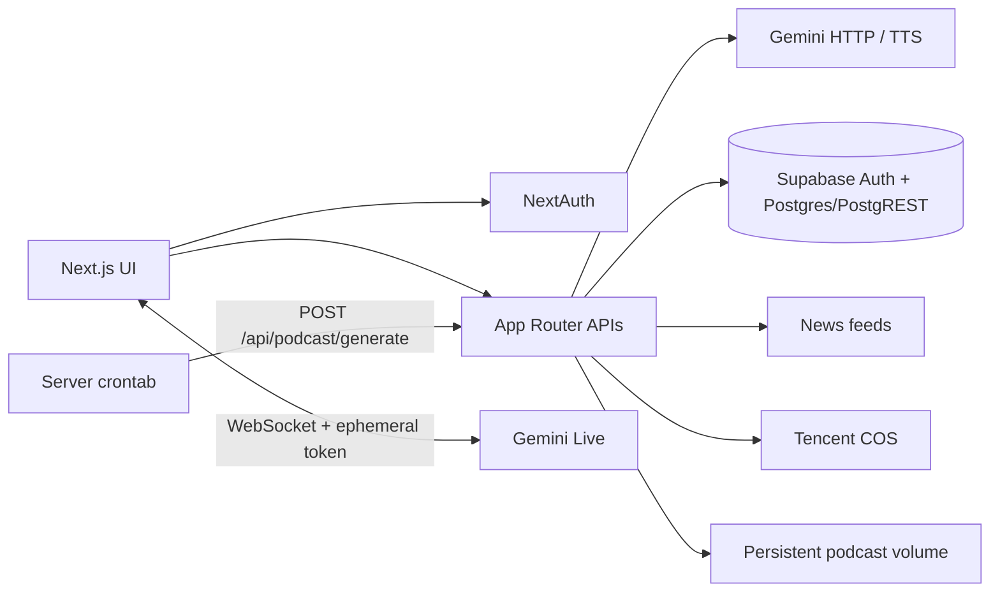

# LingDaily

LingDaily 是一个以新闻和真实场景为素材的多语言口语学习应用。它使用 Next.js App Router、NextAuth、Supabase 与 Gemini Live，支持双向实时语音、学习记录、生词、进度和双语新闻播客。

## 功能

- 邮箱密码登录，以及可选的 Google、Linux.do OAuth。
- 9 种界面/母语选项与 8 种目标学习语言，目标语言和母语必须不同。
- 新闻模式与角色扮演场景模式。
- Gemini Live 双向语音：麦克风输入、流式音频播放、打断和取消、文字消息与工具调用。
- AI 实时纠错：对话中检测可改进的表达并给出地道改写（`record_language_correction` 工具调用），在对话流内展示。
- 新闻标题翻译，并按所选目标语言生成练习提示。
- 对话历史自动同步、乐观并发保护、学习天数和练习进度统计；进度页含今日进度环、词汇掌握与本周量表看板。
- 生词、短语和语法点自动提取，按语言筛选并使用稳定游标分页。
- 管理后台维护系统场景，用户也可创建公开或私有场景。
- 每日双语新闻播客：脚本生成、多说话人 TTS、COS 发布、数据库归档、网页播放和 RSS。
- 集中式主题：shadcn CSS 变量统一浅/深色与品牌配色，支持 system/dark/light 切换，首页带彩虹极光+胶片颗粒背景。

## 架构



主要边界如下：

| 层 | 目录/入口 | 职责 |
| --- | --- | --- |
| 页面 | `app/` | 首页、对话、历史、进度、生词、场景管理和播客页面 |
| API | `app/api/` | 鉴权后的令牌、翻译、历史、学习项、场景和播客接口 |
| Gemini Live | `app/lib/GeminiLiveService.js` | WebSocket 生命周期、麦克风输入和流式音频调度 |
| 业务模块 | `app/lib/` | 语言模型、历史存储、场景提示和播客流水线 |
| 数据库 | `supabase/migrations/` | RLS、索引、RPC、兼容升级与系统场景 seed |
| 部署 | `Dockerfile`、`docker-compose.yml` | 8000 端口应用与持久化播客目录 |

Gemini Live 的浏览器连接先向 `POST /api/realtime-token` 申请一次性令牌，再建立 WebSocket。旧的 `/api/gemini-token` 暂时保留为带弃用响应头的兼容别名。旧的 `/api/learning/unfamiliar-english` 同样继续代理到统一的学习项接口。

播客生成链路为：服务器 cron → 生成接口 → 新闻源 → Gemini 结构化脚本 → 多说话人 TTS → MP3 → COS → Supabase → 本地 manifest/RSS 镜像。Supabase 暂时不可用时，生成接口会退回已有的本地 manifest/feed 兼容路径。

## 快速开始

要求：Node.js 20.19+、npm，以及一个可用的 Supabase 项目和 Gemini API Key。

```bash
cp .env.example .env.local
npm ci
npm run dev
```

开发服务器地址是 <http://localhost:8000>。

首次运行前，应按下一节将数据库迁移应用到目标 Supabase 项目。生产构建与启动：

```bash
npm run build
npm start
```

## 环境变量

完整模板见 [`.env.example`](.env.example)。本地开发使用 `.env.local`；服务器上的 `docker-compose.yml` 从 `.env` 读取运行时变量。

关键约定：

- `GEMINI_API_KEY` 是服务端标准变量；`GOOGLE_API_KEY` 仅作为旧部署别名。
- `GEMINI_BASE_URL` 是可选的服务端 Gemini HTTP/TTS 代理；`GOOGLE_GEMINI_BASE_URL` 是旧别名。
- `NEXT_PUBLIC_GEMINI_BASE_URL` 是浏览器 Gemini Live/WebSocket 代理。若整套请求都需要代理，服务端和 `NEXT_PUBLIC_` 两项应指向同一受控代理。
- `NEXT_PUBLIC_SUPABASE_URL` 与 `NEXT_PUBLIC_SUPABASE_ANON_KEY` 可以公开；`SUPABASE_SERVICE_ROLE_KEY` 必须只存在于服务端。
- `PODCAST_SECRET`、COS Secret 和 OAuth Secret 只能放在服务端环境，不得提交到仓库。
- 不要创建或使用 `NEXT_PUBLIC_GEMINI_API_KEY`。任何 `NEXT_PUBLIC_*` 值都会进入浏览器包。

`NEXT_PUBLIC_*` 在镜像构建时写入前端包，修改后必须重新构建镜像。GitHub 部署工作流已经把站点 URL、Supabase 公共配置和 Gemini 公共代理作为 build args；其余密钥由服务器 `.env` 在运行时注入。

## 数据库迁移

生产库是早期手工建表的 Supabase 库，当前没有
`supabase_migrations.schema_migrations`。因此本次升级使用 SQL Editor 手工、
逐文件执行；在为远端建立 migration baseline 前，不要再混用
`supabase db push`，否则会无法判断哪些迁移已执行。

生产执行顺序：

1. 先做可恢复的数据库备份。
2. 在 SQL Editor 选择 `No limit`，执行
   [`scripts/preflight-production.sql`](scripts/preflight-production.sql)。只有所有
   `BLOCKER` 都为零时才能继续；`REVIEW` 项需人工确认。
3. 按文件名顺序逐个、整份执行下列七个迁移，每个文件成功后再进入下一个。
   每个文件自带 `BEGIN`/`COMMIT`；不要去掉事务边界，也不要只执行其中一段。
4. 执行 [`scripts/postflight-production.sql`](scripts/postflight-production.sql)，确认
   所有非 `INFO` 项均为 `PASS`，并将各表行数与 preflight 结果对比。
5. 再验证登录、生词、对话历史、场景与播客 cron。

七个迁移为：

1. `202607110001_create_user_preferences.sql`：语言偏好；兼容旧的 text `user_id` 和缺列，异常重复行会中止。
2. `202607110002_create_unfamiliar_english.sql`：学习项事件表与 RLS。
3. `202607110003_upgrade_podcast_pipeline.sql`：播客状态、生成租约、公开读取策略。
4. `202607110004_upgrade_chat_history.sql`：历史修订号、并发保存 RPC、来源类型。
5. `202607110005_multilingual_learning_items.sql`：学习项和偏好的多语言升级。
6. `202607110006_multilingual_scenarios.sql`：兼容旧两表/新单表的多语言场景升级。
7. `202607110007_seed_scenarios.sql`：幂等系统场景 seed；发现相同语言对的重复场景时中止，不自动删除或合并。

迁移不会自动删除重复偏好、重复场景或非数组对话正文；发现这些
异常时显式事务会使整个文件回滚并要求先人工处理。失败后不要单独执行该文件的
`COMMIT`。不要把这些 SQL 指向机器上
其他项目正在使用的 PostgreSQL。

仓库提供完全隔离的迁移测试：

```bash
./scripts/test-migrations.sh
```

脚本只会启动名称以 `lingdaily-pgsql-` 开头的临时 PostgreSQL 容器和数据库，不发布任何宿主端口，并在退出时删除自己的容器。它验证 fresh schema、旧 text 偏好表、最早的标量播客图片/非唯一索引、旧场景两表结构、真实生产 catalog fixture、RLS/ACL、两个 RPC、重跑幂等性，以及异常聊天/重复场景必须回滚且不丢数据。它不会连接、停止或复用宿主机已有的 PostgreSQL 进程。

## 生产播客 cron 兼容

GitHub 的播客定时工作流已禁用，正式任务继续由服务器 crontab 触发。现有请求契约保持不变：

```text
POST http://localhost:8000/api/podcast/generate
x-podcast-secret: <PODCAST_SECRET>
无请求体，无必需 query 参数
```

等价的安全示例（不要把真实密钥提交到脚本或仓库）：

```bash
curl -s -X POST 'http://localhost:8000/api/podcast/generate' \
  -H "x-podcast-secret: $PODCAST_SECRET" \
  --max-time 350
```

兼容行为：

- 无 query 时按 `PODCAST_TIMEZONE` 的当天日期生成；默认 `Asia/Shanghai`。
- 当天已完成时返回成功并跳过，不会重复生成。
- 成功 JSON 不含名为 `error` 的字段，以兼容旧 cron 对响应文本的判断。
- 失败 JSON 保留 `error` 字段，旧脚本会按原逻辑重试。
- `date=YYYY-MM-DD` 和 `force=true` 只是运维用可选参数，正式 cron 不需要添加。
- 接口执行预算为 300 秒，现有 cron 的 350 秒超时应保留或调高，不应调低。

如果服务器脚本中曾直接写入过密钥，密钥暴露后应在服务器环境与应用环境中同时轮换，但接口 path/header 不需要改变。

## Docker 与部署

生产 `docker-compose.yml` 只启动应用，不包含 PostgreSQL，因此不会占用或修改宿主机 5432。应用数据库是外部 Supabase；本地 SQL 验证使用上一节的隔离临时容器。

推荐发布顺序：

1. 备份 Supabase，并在 staging 运行 001–007 和迁移测试。
2. 在生产 Supabase 按顺序应用尚未执行的迁移。
3. 更新服务器 `.env`，确认 `PODCAST_SECRET` 和 COS 配置仍在。
4. 拉取新镜像并运行 `docker compose up -d`。
5. 检查首页、登录、`/podcasts/feed.xml`，再用原 path/header 手动触发一次跳过或生成验证。

`./podcasts` 会挂载到容器 `/app/public/podcasts`，用于保留旧 manifest、RSS 和本地音频镜像。不要在更新镜像时删除这个目录。

发布前的本地质量检查：

```bash
npm run check
```

## Sitemap 与隐私

Sitemap 只包含真实公开页面：首页、播客列表和已完成的播客详情。生成过程使用 Supabase anon key 和播客公开 RLS，不读取 `chat_history`，也不会把用户 ID、对话 key、后台或登录后页面写进公开 sitemap。

## Gemini 代理

可选 Nginx 示例位于 [`nginx/gemini-proxy.conf`](nginx/gemini-proxy.conf)。上线时应替换示例域名、启用 HTTPS、限制访问并设置合理的速率/连接数上限，避免把代理暴露成不受控的公共转发服务。
