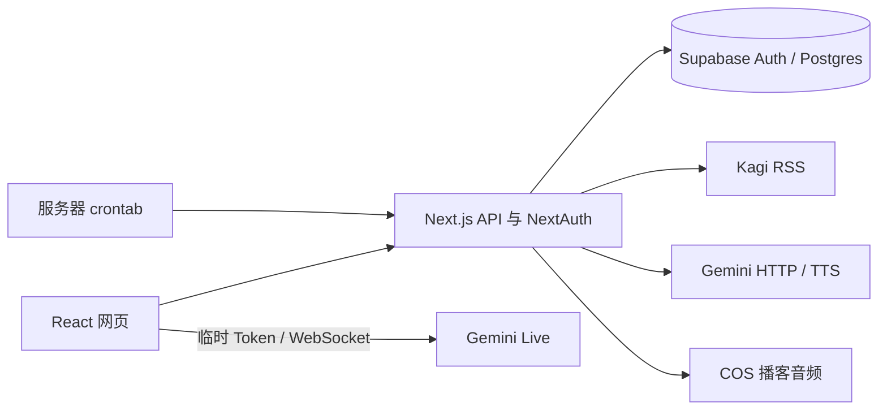

# 现状与迁移评估

核查日期：2026-09-29。研究时的代码基线：`99fc2ca`，当时 `ios/` 为空工程。后续已增加本地交互体验版，见 [09 体验版说明](09-prototype.md)；本文保留服务端迁移核查基线，生产实际状态另行核实。

## 当前系统

| 能力 | 本地证据 | 对 iOS 的影响 |
| --- | --- | --- |
| Next.js 15、React 19、Node 20.19+ | [package.json](../../package.json)、[AGENTS.md](../../AGENTS.md) | Next.js 服务需继续运行，不能把整个项目当静态资源打包 |
| 邮箱、Google、Linux.do 登录 | [auth.js](../../app/auth.js) | 原生登录与旧用户映射必须单独设计 |
| 新闻 | [news API](../../app/api/news/route.js) | 当前响应是 RSS XML，不能统一按 JSON 解码 |
| 系统/用户场景 | [scenarios API](../../app/api/scenarios/route.js) | 可复用数据；客户端需区分系统、公开用户、私有用户内容 |
| 实时语音 | [GeminiLiveService.js](../../app/lib/GeminiLiveService.js) | WebSocket 协议可参考；Web Audio、麦克风与播放实现要重写 |
| 历史保存 | [history API](../../app/api/chat-history/route.js)、[conversation.js](../../app/talk/_lib/conversation.js) | 需要复现消息合并与冲突处理规则 |
| 学习项与进度 | [items API](../../app/api/learning/items/route.js)、[progress API](../../app/api/learning/progress/route.js) | 可共享结果；不能将“收集词数”直接标成“已掌握词数” |
| 播客 | [repository.js](../../app/lib/podcast/repository.js) | iOS 消费音频与文稿；生成、上传、调度留在服务端 |
| 主题 | [globals.css](../../app/globals.css) | 已有紫粉蓝品牌和明暗色，适合映射成原生语义色 |
| iOS 工程 | [LingDaily.xcodeproj](../../ios/LingDaily/LingDaily.xcodeproj) | 研究时为空模板；后续本地原型及验证状态见 09，目标版本仍为 15.0 |

## 迁移路径比较

| 路径 | 可直接复用 | 主要投入 | 判断 |
| --- | --- | --- | --- |
| WKWebView / 网页容器 | 大部分网页 UI 和 JS | WebView 登录、音频权限、生命周期和原生体验适配 | 适合短期验证访问流程；核心语音仍要专项验证 |
| React Native | JS 业务思路、部分纯函数 | DOM 组件重做，音频需要原生能力，增加跨端工具链 | 如果明确近期同时做 Android，可重新评估 |
| SwiftUI | 服务端、数据库、协议和产品规则 | Swift 界面、认证、音频与同步 | 本项目当前 iOS 目标的推荐路径 |

这是基于代码和产品核心能力的工程判断，不承诺某种技术自动获得更好的性能或审核结果。

## 需要先解决的问题

### 1. 原生登录不等于复用网页 Cookie

私有路由普遍使用 `auth()`。Credentials 登录获得 Supabase Token，但 OAuth 登录主要将用户映射为 Supabase UUID，并不因此获得同样的 Supabase 用户会话。`ensureAuthUser()` 失败时还可能保留第三方 ID。

因此不能将 NextAuth JWT 当成 Supabase JWT，也不能假设用户在 iOS 重新用 Google/Apple 登录后一定会获得原账号。迁移前核查 UUID、provider identity、邮箱验证状态和旧 text owner；映射有歧义时保留账号，提供恢复/绑定流程。

### 2. 语音实现与当前官方协议存在版本差异

代码硬编码 `gemini-3.1-flash-live-preview`，WebSocket 和 Token minting 使用 `v1alpha`。本次官方资料中的临时 Token 连接版本是 `v1beta`，示例模型也已变化。此差异是待联调项，不能据此断言当前线上已经故障。[官方临时 Token 文档](https://ai.google.dev/gemini-api/docs/live-api/ephemeral-tokens)

目前主对话页约 1143 行，Live Service 约 948 行，涵盖页面状态、音频、协议、工具和数据保存。iOS 需要明确这些责任边界，避免把它们搬进一个 ViewModel。

### 3. 数据身份并不完整

新闻 `news_key` 取 `originalTitle || title || link || id` 后移除空白；它不是 URL 或数据库新闻 ID。翻译标题的变化、不同新闻同标题等都可能影响身份稳定性。

`chat_history` 唯一键是 `(user_id, news_key)`，没有独立的学习语言字段。场景自己的 ID 含有业务语言背景，但普通新闻切换语言仍可能命中同一条历史。发布多语言续聊前必须完成专项决策，见 [数据约定](04-data-contracts.md#语言与主题身份的迁移决策)。

### 4. 保存成功与收到请求不同

现有学习项工具会先回 `accepted`，再异步保存；当前写入没有跨重试的 `clientEventId` 唯一约束。移动网络断线后盲目重试，可能重复记词。历史写入已有 `revision`，但客户端被终止时不能依靠一次最后上传保证保存。

### 5. 统计没有完整的学习时长与掌握度模型

目前进度主要根据真实用户消息、时间和来源聚合；没有“每次练习 session”“实际有效时长”“复习结果”的规范表。iOS 首版应显示已有定义的轮次、活跃天数和收集项，不虚构分钟数或掌握率。需要这些指标时再增加明确的数据模型。

### 6. 上架能力还有缺口

本次没有在 `app/api/` 找到账号删除、公开场景举报/屏蔽、移动端授权回调等对应业务接口。也没有验证隐私政策是否覆盖语音到第三方 AI 的数据流。若首版展示公开用户场景，这些产品能力必须纳入发布范围；只使用系统和本人私有场景时，服务端也要限制相应移动入口。[App Review Guidelines](https://developer.apple.com/app-store/review/guidelines/)

## 复用边界

直接保留服务端的新闻抓取、翻译、播客任务、数据库和管理功能。复用历史 identity、消息结构、语言目录、校验规则和测试样例的含义。Swift 侧重新实现 UI、AVAudioSession/AVAudioEngine、网络会话、Keychain 和 App 生命周期。

提示词应逐步在服务端形成有版本的公共来源；新闻和用户场景仍作为不可信内容，不能因为 iOS 客户端传了“系统场景”标记就赋予信任。
