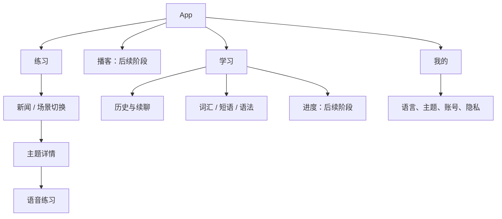

# 设计语言与页面模板

状态：0.3.0 起 iOS 采用“纸与墨”视觉；本文前半部分是**已落地**的原则、元素与组件，代码单一来源是 [Brand.swift](../../ios/LingDaily/LingDaily/DesignSystem/Brand.swift)。“信息架构”之后是完整迁移的**规划**，尚未实现的页面按这里的原则落地。

## 设计原则

1. **如无必要，勿增实体。** 新增颜色、字号、组件、按钮样式或页面前，先证明现有元素做不到。一个页面只有一个主动作；同一信息不在一屏重复出现（例如隐私说明只在开始对话前和“我的”各出现一次）。
2. **人在前，功能在后。** 用户是来和一个人说话的：场景以对话对象（头像、名字、身份）和对方的第一句话开场，而不是功能图标或口号。界面文案不写“AI 正在……”，写“Alex 正在回复”；是否由模型生成只在需要知情同意的位置说明。
3. **内容即界面。** 英语学习内容（对方的话、你的话、更自然的说法）是视觉主角，用衬线体排成“书页”；界面控件用系统字体、保持低调。不用渐变、光效、sparkles 之类装饰来制造“科技感”。
4. **反馈贴着原句。** 改写建议紧跟在它针对的那句话下面（批注），而不是弹窗或底部大卡片。
5. **动作永远够得着。** 对话页底部只放当前阶段需要的一组动作：要么输入框，要么“再说一次 / 下一步”。提示是三个明确层级（意思 → 关键词 → 参考说法），不是循环切换的按钮。
6. **诚实克制。** 不展示没有依据的分数、等级或“已掌握”；统计只写事实（开口几次、重说几次）。

## 视觉元素

### 颜色：两种中性色 + 一个强调色 + 场景色

规则：**墨色 = 动作和“你自己的话”**（主按钮、你的气泡）；**强调色 = 状态**（进度、选中 Tab、已收藏、“更自然的说法”标签）。强调色不做大面积填充。

| Token | 浅色 | 深色 | 用途 | 对比度（浅 / 深） |
| --- | --- | --- | --- | --- |
| `page` | `#F6F2EA` | `#151412` | 页面底色（纸） | — |
| `surface` | `#FFFDF8` | `#211F1B` | 卡片、对方气泡、输入框 | — |
| `ink` | `#1E1C19` | `#F2EEE6` | 标题、正文、主按钮底、你的气泡 | 15.2 / 15.9 对 page |
| `onInk` | `#FFFDF8` | `#151412` | 墨色底上的文字 | 16.7 |
| `secondary` | `#6F6A62` | `#A39D93` | 说明、元信息 | 4.8 / 6.8 对 page |
| `line` | `#E6DFD3` | `#35322C` | 分割线、描边 | 装饰，不承载文字 |
| `accent` | `#C2451E` | `#F08A64` | 状态强调（朱红） | 4.5 / 7.5 对 page |
| `inkOnTone` | ink 72% | ink 72% | 场景色卡上的次要文字 | ≥ 5.8 |

**场景色**（`Brand.tone(scenarioID)`）：每个场景一个低饱和色（用户新建的场景按 id 稳定散列到这四色之一，不新增颜色），用于它的卡片和对话对象头像，让“这个人”在首页、准备页、对话页、总结和记录里保持同一个颜色。

| 场景 | 浅色 | 深色 |
| --- | --- | --- |
| deadline 同事 Alex | `#DCE6D3` 鼠尾草绿 | `#28332A` |
| hotel 前台 Jamie | `#D6E2EE` 雾蓝 | `#232E38` |
| introduction 面试官 Taylor | `#F0E2B6` 奶油黄 | `#37301F` |
| coffee 咖啡师 Sam | `#F1D8CA` 陶土粉 | `#3A2A23` |
| 其他/未来场景 | `#E9E3D8` | `#2C2924` |

新增场景时只给它挑一个场景色，不新增其他颜色。对比度按 WCAG sRGB 相对亮度计算，正文目标 ≥ 4.5:1。

### 字体：两种字形

| 用途 | 字形 | 示例 |
| --- | --- | --- |
| 界面与中文 | 系统字体（中文回退苹方） | 页面标题 `largeTitle.bold`、卡片标题 `headline`、说明 `subheadline`、元信息 `caption` |
| 英语学习内容 | 系统衬线（New York），`Brand.english(style)` | 气泡正文 `body`；首页第一句、“更自然的说法”、收藏句 `title3` |

全部使用 Dynamic Type 文本样式，不写死字号。iOS 17+ 会对多行标题做均衡断行（避免末行只剩一个词），所以衬线句子有时会提前换行，这是系统排版行为，不是布局错误。

### 形状、间距、图标、动效

- 圆角只有三档：场景色卡 24pt；普通卡片与气泡 20pt（批注 16pt）；按钮、标签、输入框用胶囊。
- 页面水平边距 20pt（对话页 16pt），卡片内边距 16–22pt；iPad 内容列最宽 620pt（`readableColumn()`）。
- 点击区域至少 44×44pt。
- 图标只用线性 SF Symbols 表达动作（关闭、朗读、麦克风、收藏、发送），不用图标装饰标题或当作场景插画——场景由人物头像代表。
- 动效只有两处：新消息滚动到底（200ms）和对方“正在回复”的三点；开启“减弱动态效果”时三点静止。

## 组件（全部）

| 组件 | 位置 | 职责 |
| --- | --- | --- |
| `SolidButtonStyle` | Brand.swift | 唯一按钮样式：墨色实心（主）/ 描边（次） |
| `Avatar` | Brand.swift | 对话对象：场景色 + 名字首字母（衬线） |
| `PageTitle` | Brand.swift | Tab 页大标题 + 一行说明 |
| `surfaceCard()` / `readableColumn()` | Brand.swift | 卡片容器；阅读宽度 |
| `EmptyState` / `StorageBanner` | Brand.swift | 空状态；本机保存失败提示与重试 |
| `SceneCard` / `StepProgress` | PracticeHomeView.swift | 场景卡（人 + 第一句 + 任务）；三段进度 |
| `MessageBubble` / `FeedbackNote` / `TypingDots` | ConversationView.swift | 对话气泡（单条可译、可听）；贴在原句下的改写批注（含“已加入词库”）；正在回复 |

历史记录详情复用 `MessageBubble` + `FeedbackNote`，与对话页同构。新组件的门槛：至少两个页面要用，或者现有组件改参数做不到。

## 当前页面

| 页面 | 结构 |
| --- | --- |
| 练习（首页） | 日期 + 问候（右侧唯一按钮“新场景”）→ “继续和 X 的对话”（有未完成时）→ 我的场景（标“我的”，长按删除）→ 4 张内置场景卡 |
| 新场景 | 一句话描述（≤300 字）+ 三个示例 → 底部“生成场景”；成功后直接进入准备页 |
| 准备 | 场景色卡（人物、标题、情境）→ 三个任务 → 可选目标（背景折叠）→ 底部模式分段（默认语音、记住选择）+“进入语音通话 / 开始文字对话”+ 一行数据说明 |
| 对话 | 固定头部（关闭、人物、朗读开关、进度与当前任务）→ 情境旁白 → 气泡与批注 → 底部：提示三级 + 输入框，或“再说一次 / 下一步” |
| 总结 | 场景色卡（完成语 + 事实统计）→ 带走这几句（可收藏）→ 底部“完成” |
| 学习 | 标题 + 统计 → 分段（练习记录 / 词库）→ 列表；词库条目标注单词/短语/语法/其他 |
| 我的 | 外观、自动朗读 → 版本号 |

与网页的关系：网页仍是紫色品牌；iOS 0.3.0 起改用纸墨视觉以去掉“AI 模板感”。两端通过产品名、内容和文案语气保持一致；是否把网页也迁到同一套视觉，待产品确认。

## 信息架构

完整目标导航为“练习、播客、学习、我的”四个 Tab。核心闭环阶段只展示已经可用的“练习、学习、我的”；播客完成后再加入相应 Tab。

登录仅在需要账号的操作前出现；公开内容可先浏览。界面语言、母语和学习语言是三个概念，不能共用一个开关。初期 UI 文案覆盖中/英/日，其余界面语言回退英文；学习语言目录仍与服务端一致。

## 后续页面的组件（规划）

以下是完整迁移时新页面需要的组件及必须设计的状态。实现时优先复用上面的现有组件，只有做不到时才新增。

| 组件 | 共用规则 | 必须设计的状态 |
| --- | --- | --- |
| `PrimaryButton` | 每个主要区域一个主动作；清晰动词 | 默认、按下、处理中、不可用、失败后重试 |
| `TopicCard` | 来源、时间/难度、标题、短摘要；整卡操作语义一致 | 有图、无图、长标题、过期缓存 |
| `LanguagePairPicker` | 明确显示“学习语言 / 母语” | 相同语言冲突、保存中、未保存 |
| `StatusBanner` | 一句话说明发生了什么，必要时给一个恢复动作 | 离线、会话中断、保存失败 |
| `ConversationBubble` | 区分用户和导师，正文可选中 | 流式、完成、无转录、长段落 |
| `CorrectionCard` | 原句、改写、简短解释；不评价人格 | 展开、收起；当次练习临时内容 |
| `VoiceControls` | 麦克风、结束、文字输入相互独立 | 连接中、收音、播放、静音、断线 |
| `LearningItemRow` | 类型、词条、解释、来源语境 | 无解释、长词条、分页加载 |
| `AsyncContent` | 内容区统一处理异步状态 | 初次加载、空、错误、已有内容刷新 |

“模型接受工具调用”和“数据库已保存”必须有不同的反馈。保存状态使用“保存中 / 已保存 / 待同步 / 保存失败”，只在服务端确认后显示“已保存”。

## 页面模板

### A. 列表页：新闻、场景、历史

结构：导航标题 → 分段/分类筛选 → 内容列表 → 分页状态。刷新时保留已有内容；筛选切换取消旧请求，避免迟到结果覆盖新筛选。

| 区域 | 内容 | 交互 |
| --- | --- | --- |
| 顶部 | 页面名、必要的语言入口 | 系统导航栏，避免堆放多个主按钮 |
| 筛选 | 新闻分类或场景分类 | 保留选择；显示选中状态 |
| 卡片 | 标题、来源/难度、摘要 | 进入详情；外部原文单独标识 |
| 底部 | 加载更多/已到底 | 使用服务端 cursor，失败不清空列表 |

空态示例：“这个分类暂时没有内容”，动作“换个分类”；网络错误示例：“暂时无法加载”，动作“重试”。

### B. 主题详情页

结构：来源与日期 → 标题 → 摘要/场景说明 → 语言对 → 底部“开始练习”。有历史时显示“继续练习”，并说明当前语言对。新闻保留出处入口；不将新闻原文无条件复制进 App。

点击开始依次检查登录、AI 数据说明、语言对、麦克风权限。取消任一步都回到可浏览状态；不要在用户阅读详情时自动开麦。

### C. 语音练习页

当前逐句对话页的结构见上文“当前页面”。接入 Gemini Live 连续语音后，保持同一骨架：固定头部（人物、进度、连接/保存状态）→ 气泡与批注 → 底部控制区（麦克风、结束、文字输入相互独立）。

首次模型输出失败应有可见恢复状态，不能只显示“连接成功”。麦克风静音时对方仍可说话；断线时停止上传并显示“重新连接”。用户向上阅读时不强制滚到底，新消息用轻量提示。

主动返回仍在练习的页面，要让用户明确结束；切后台则按架构文档停止录音和连接。正在听播客时开始练习，先暂停播客；结束练习后由用户恢复播放。

### D. 学习页

“历史 / 学习项”提供稳定入口，后续增加进度卡。学习项按学习语言筛选，类型显示为词汇、短语、语法、其他。当前没有复习状态模型，按钮不写“已掌握”。删除历史使用二次确认，保存失败时明确允许重试。

### E. 播客页

结构：节目列表 → 节目详情（标题、双语摘要、播放、文稿、8 个学习词条）。播放器有加载、暂停、播放、结束、音频不可用状态。进度拖动和倍速只在对应能力接入后展示；首版默认在线播放，下载属于独立后续功能。

### F. 我的与登录

我的：账号、语言、主题、隐私、帮助、退出、删除账号。登录：邮箱密码、恢复密码、注册、已验证可用的第三方入口。输入错误靠近对应字段，密码可显示/隐藏；自动填充和密码管理器可用。

首次 AI 说明要清楚写出发送给谁、发送什么和用途，给予继续与取消；麦克风系统权限是另一项授权，二者不合并成一句“同意条款”。具体文字待确认实际服务配置和隐私政策后定稿。

## 页面验收样例

每个页面至少检查：浅色/深色、初次加载、空数据、服务端错误、断网、小屏、大字体、VoiceOver、中文/英文/日文长文本。语音页另查拒绝麦克风、耳机切换、来电、锁屏、重复点击连接、账号切换和消息待同步。

后续在工程中建立仅供开发的 Component Gallery，集中预览上述组件状态；该画廊尚未实现。新增页面使用 [页面规格模板](templates/screen-spec.md)，先填数据和失败状态，再写界面。
