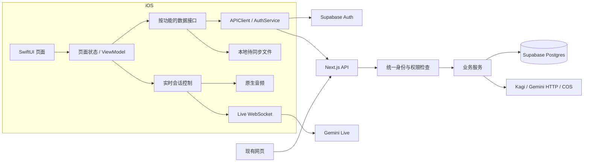
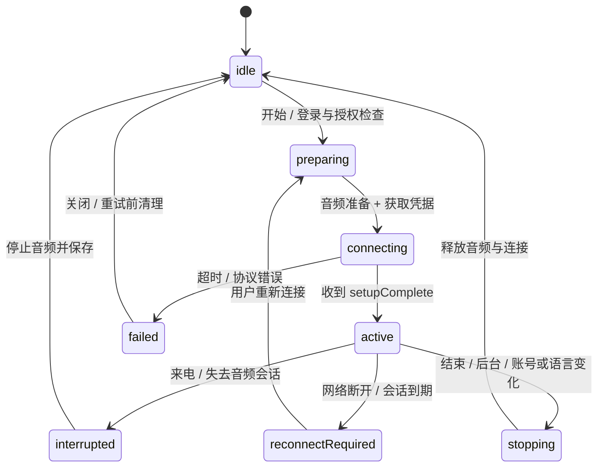

# 架构设计

状态：正式业务的目标架构草案。账号、云同步和服务端公共身份函数尚未实现；2026-09-30已落地受开发配对保护的原生Gemini Live，同时保留逐轮HTTP练习，实际结构见 [10 AI 接入说明](10-ai-integration.md)。

## 系统边界



iOS 直接访问 Supabase Auth 获取用户会话；业务数据经过 Next.js，沿用现有授权和兼容逻辑。客户端持有 Gemini 短期凭据并传输实时音频。长期 Gemini 密钥、service role、播客和 COS 密钥只存在于服务端。

## iOS 15 技术基线

| 职责 | 建议选型 | 约束 |
| --- | --- | --- |
| 界面 | SwiftUI，必要时封装 UIKit | 单 App target 起步 |
| 状态 | `ObservableObject`、`@Published`、`@StateObject`；UI 状态在 MainActor | 不把 iOS 17 的 Observation 当基础能力 |
| 导航 | `NavigationView` 的 stack 风格 + 集中定义路由意图 + sheet | 未来可封装 iOS 16+ 的 NavigationStack，但不先维护两套导航 |
| HTTP | `URLSession`、`Codable`、async/await | 接口适配器处理 XML、JSON 和不同响应结构 |
| Live | `URLSessionWebSocketTask` + 明确事件解码 | 用小型协议适配器隔离 Gemini 版本差异 |
| 音频 | `AVAudioSession`、`AVAudioEngine`、`AVAudioConverter`、`AVAudioPlayerNode` | 输入输出采样率与硬件路由独立 |
| 播客 | `AVPlayer` | 后续再加入后台播放与锁屏控制 |
| 凭据 | Keychain | 不放 UserDefaults、日志、URL 回调参数或源代码 |
| 本地业务缓存 | 有版本的 Codable 文件，原子写入 | 数据量和查询需求增长后再评估 Core Data/SQLite |
| 测试 | XCTest；关键页面流程用 XCUITest | 针对并发、失败和兼容行为测试 |

NavigationStack 的系统基线是 iOS 16；Apple 对 iOS 17 之前的观察模型仍提供 ObservableObject 方案；SwiftData 从 iOS 17 提供。[导航迁移](https://developer.apple.com/documentation/swiftui/migrating-to-new-navigation-types)、[模型观察](https://developer.apple.com/documentation/swiftui/monitoring-model-data-changes-in-your-app)、[SwiftData](https://developer.apple.com/videos/play/wwdc2024/10137/)

本次读取的 Supabase Swift **main 分支** `Package.swift` 声明最低 iOS 16；这不能代表所有已发布版本。P0 先查可维护的正式 tag 和传递依赖是否兼容 15，再锁定版本。若没有合适版本，用 URLSession 对接官方 Auth HTTP 接口；不自行实现密码、JWT 签名或 OAuth 加密算法。不得为了安装 SDK 默默抬高最低系统版本。[当前包声明](https://raw.githubusercontent.com/supabase/supabase-swift/main/Package.swift)

## 目录和职责

建议在现有 `ios/LingDaily/LingDaily/` 下逐步形成：

```text
App/                 App 入口、依赖装配、账号与主题状态、导航
DesignSystem/        语义色、排版、间距、共用组件、开发预览
Features/
  Authentication/    登录、注册、恢复账号
  Practice/          新闻/场景入口、详情、语言选择
  Conversation/      实时练习、转录、纠错、结束与保存反馈
  Learning/          历史、学习项、进度
  Podcasts/          节目浏览与播放
  Settings/          主题、隐私、账号设置
Core/
  Models/            少量跨功能领域值类型，例如 LanguagePair
  Networking/        APIClient、错误映射、DTO 与协议解码
  Authentication/    Token 获取、刷新、Keychain
  Realtime/          连接状态、协议、工具调用分发
  Audio/             录音、重采样、播放、路由和中断
  Persistence/       待同步队列和本地文件版本
Resources/           Assets、文案、应用隐私资源
```

每个 Feature 只在需要时增加 `View`、`ViewModel`、`Repository` 文件。模型放在使用它的功能附近；只有真实跨功能复用才移动到 Core。目录表达责任，不要求每一层再建立 Swift Package。

View 负责布局和用户意图；ViewModel 负责加载/空/错误等状态、取消任务和转换显示数据；Repository 负责远端与本地数据协调。独立的业务用例只用于真正复杂的流程，例如“开始实时练习”“合并冲突历史”。简单读取不强制绕过多层空转发。

采用构造参数注入依赖，在 App 入口集中装配。协议优先用于网络、时间、音频等需要替身的边界。避免全局单例相互调用，也不需要通用 DI 容器、事件总线或插件系统。

## 身份与会话

建议服务端逐项引入 `resolvePrincipal(request)`，输出经过验证的账号身份：

1. 有 `Authorization: Bearer` 时，验证为本项目的 Supabase 用户 Access Token。无效 Token 返回 401，不回退到同请求中的其他 Cookie 身份。
2. 无 Bearer 时，沿用网页 NextAuth 会话；对旧非 UUID 身份保持已有兼容行为，移动入口要求已完成映射。
3. 业务服务只接受已经验证的 principal；请求正文里的 `userId` 永远不能决定 owner。
4. 签名/issuer/audience/expiry 校验使用官方 SDK 或成熟库；P0 核查生产签名方式。需要即时确认用户有效性时使用 Auth 服务验证，不能只解码 JWT。
5. 管理员仍走明确的管理员授权；用户 Token 不因此获得管理员或播客 cron 权限。

Supabase 文档说明 JWT 验证需要实际验证签名与 claims；`getUser(jwt)` 可向 Auth 服务获取已验证用户。采用哪条路径需结合签名密钥和注销策略。[JWT](https://supabase.com/docs/guides/auth/jwts)、[getUser](https://supabase.com/docs/reference/javascript/auth-getuser)

客户端只允许一个 Token 刷新任务进行；同时遇到 401 的请求等待同一刷新结果。每个原请求最多因此重试一次。刷新失败进入重新登录；不能将旧账号的写入任务附上新账号 Token 重放。

退出时先停止 Live、取消任务、清理内存音频并清除凭据。待同步内容按账号隔离；有未保存内容时提供清楚的保存/丢弃选择。最终退出应使其他账号不可见这些内容。删除账号需要服务端操作与重新认证，不能只清本地 Keychain。

OAuth 使用系统授权会话；采用 PKCE/state 并严格限制回调，原生 Apple 登录采用 nonce 和服务端/身份服务验证。旧 OAuth 账号迁移必须证明账号归属，不以用户输入邮箱直接合并。[PKCE](https://supabase.com/docs/guides/auth/sessions/pkce-flow)、[原生 ID Token 登录](https://supabase.com/docs/reference/swift/auth-signinwithidtoken)

## 实时语音

### 2026-09-30 实际落地（开发体验）

文字模式继续使用SpeechController的设备端ASR与系统TTS；新增Core/Models/DictationTranscript按音频时间窗口累积整段听写、支持末句等待。准备页可选模式，默认语音且记住用户选择，语音入口不发逐轮HTTP请求，用户点开始后才采集。Live输入/输出转录仅驱动气泡，音频直接送模型并直接播放返回PCM。

Live启动在setupComplete后串行排队一次固定开场信号，再启动采集与上传。开场clientContent带turnComplete，不能与首批PCM通过独立Task竞争顺序，否则会干扰音频轮次。输入门在setupComplete时打开一次，启动上传泵不再重新打开，确保用户快速静音不会被上传启动覆盖。协议客户端断线后保留上传计数及固定错误阶段/数字关闭码供opt-in测试诊断，不记录URL、token或供应商错误正文。

setupComplete后开采集时，先保留/重排已调度开场音频并更换schedulingGeneration，再停引擎、安装tap、重启voice-processing图；不依赖输出图运行中加tap的隐式硬件更新。文字SpeechController持有自己的音频session激活标记和utterance身份，迟到TTS回调不能停用Live。Debug可显式开启有界数字采集/播放诊断，Release关闭；真人麦克风及开场尾音复查结果见10，离线队列回归不替代真机听感。

实际实现位于Core/Realtime（协议、工具、字幕、generation、PCM分帧/有界播放、可测试的AVAudioConverter）、Core/Network/LiveWebSocketClient、Core/Audio/LiveAudioController与Features/Practice/LivePracticeController。现有ConversationView切换文字/语音并复用气泡、批注、进度；PracticeStore复用本机v2归档和收词。连接与播放为独立generation，静音只控制输入；录音callback仅有界复制，converter/JSON/Base64/网络在其他执行路径。共享LiveMicrophonePipeline拆分大硬件回调，上传每次唤醒排空待发帧；上传/播放压力丢弃有界音频并提示，保持连接，细节见10。

2026-10-02补充：Voice Processing在连接前准备完毕，开输入tap不重启输出；引擎配置变化恢复时重排已调度音频，schedulingGeneration拒绝旧播放时间线completion；输入generation使静音前已取出的上传批次失效。工具依赖的转录尚未到达时进入最多20项的可取消队列；最终完成留600ms收尾窗口，stop幂等。显式转录final与模型turnComplete分开处理；无输入消息ID时仍存在跨轮迟到增量的歧义。未新增归档字段或修改schemaVersion。

相对草案：没有提取/修改网页prompt或`/api/realtime-token`，新增仅开发可用的`/api/ios/live-token`，服务端独立生成信任边界明确的提示并锁定token配置。无账号、数据库、云端保存、跨账号草稿或正式Supabase Bearer；这是本机开发配对能力。2026-10-02新增显式`ios:dev -- --device`：独立Debug真机配对文件、私有局域网IPv4监听、严格本地URL校验和本地网络权限；普通模式仍回环监听，Release/生产继续关闭，不替代正式认证。WebSocket仍使用经实测的v1alpha（当前SDK支持范围），未把官方新版v1beta示例机械套入现有SDK。客户端只发最小setup/model，其余配置由token供应。

未实现sessionResumption/自动重连；goAway、断网、后台、系统中断、当前设备断开/无可用路由都停止并本机保存；新设备/路由配置变化只在现有采集中检查格式并重建音频管线，忽略categoryChange，用户明确重新连接时签发新token，携带最多12条文字和当前任务作为不可信背景。恢复前先重新检查权限/设备格式，不自动恢复麦克风。新增可缺省`PracticeSession.live`，不改旧HTTP的submit/retry/advance契约；Live专用转换只在语音模式调用。纠错以具体用户消息UUID落本机ai.feedbacks，这与网页correction不落库的临时UI契约不同；没有把本机JSON上传成Web历史。

token锁模型/systemInstruction/tools/AUDIO/voice/转录/VAD（省略lockAdditionalFields锁完整配置），uses1、30分钟、建连2分钟，WebSocket host由服务端决定，App额外检查准确endpoint。参数通过白名单及上限校验后立即排队accepted，然后异步工具处理；无效工具rejected。工具语义层再次保证任务只按当前index推进且已经有用户句，重复/取消/迟到调用不能重复修改归档。

原生WSS支持服务端独立`GEMINI_LIVE_WS_BASE_URL`选择Google或受控JP/旧中转；签发仍走官方，只有短期token及实时音频经过中转，Next路由不承担音频转发。共享JS origin校验与Swift完整endpoint白名单拒绝任意目标，固定Constrained路径与generation/audio协议不变。默认直连，不继承网页代理配置；2026-10-02两个代理子域公共DNS为NXDOMAIN，因此代码已接入、远端中转联通仍待域名恢复，见10。

新增180秒实际网络PCM持续上传验证（9000帧，零丢帧），仍未取得测试宿主麦克风权限，真实录音验收待补。真实JS与共享Swift客户端已验证开场音频、输出字幕、纠错/收词，以及客户端篡改setup不覆盖token配置。模拟器构建不是实际声音/麦克风/来电验收，完整记录与待人工项目见10。

### 状态与生命周期



`active` 中收音和播放可能同时发生，所以另有 `micMuted`、`isPlaying`、`transcriptState`；不能用互斥的“正在听/正在说”枚举禁止正常打断。保存状态属于独立状态，网络连接成功不表示历史已保存。

建议首次实现以前台练习为边界：进入后台停止上传、结束连接并持久化草稿；返回前台后用户明确恢复。系统来电或 Siri 中断也停止采集，不能未经用户操作突然恢复麦克风。短暂系统提示造成的 inactive 与真正 background 要分别处理。

### 数据流与可靠性

1. 完成用户授权，配置 `.playAndRecord` 和适当的语音模式；麦克风权限允许后准备音频引擎。
2. 获取新临时 Token，建立经过验证版本的 WebSocket，发送 setup；收到 `setupComplete` 才上传麦克风 PCM。
3. 采集设备原生格式，重采样为单声道 16kHz、16-bit little-endian PCM；输出按 24kHz PCM 解码与调度。不能假设蓝牙和扬声器的硬件格式始终一致。[音频协议](https://ai.google.dev/gemini-api/docs/live-api/capabilities)
4. 录音回调只做有限的缓冲工作；JSON/Base64、网络和磁盘写入放在独立执行路径。上传和播放队列都设置有界缓冲，过载触发可观察的丢帧/重连策略，避免无限增长。
5. 每次连接分配 `connectionGeneration`，播放分配 `playbackGeneration`；旧回调、旧重采样任务和打断前的排队音频不得影响新会话。
6. 用户静音只关闭输入。模型打断事件清掉旧播放队列；音频中断/路由变化后重新检查格式、节点和 converter。
7. 模型工具先做白名单与有界参数校验，通过后立即回 `accepted`，再异步执行/持久化；无效参数回 `rejected`。只允许已有工具白名单，不能根据模型文本执行任意操作。
8. 实现新协议的到期通知、恢复句柄和连接关闭处理；明确区分恢复原会话与申请新 Token 建新会话，避免重复开场或重放工具。恢复能力在联调通过前不宣称已支持。[会话管理](https://ai.google.dev/gemini-api/docs/live-api/session-management)

Web 的“触摸手势内解锁 AudioContext”是浏览器机制，不直接搬到原生；其要保护的结果——首段音频不能丢、开始/停止顺序明确——仍需保留。

### 服务端配置与成本

现有 `/api/realtime-token` 只返回 `token`。建议向后兼容地增加协议/模型/到期/提示词版本等配置，或在确有破坏性结构变更时引入有版本的新接口。模型和允许的连接 host 由可信配置控制；不允许客户端指定任意代理或高价模型。

支持配置约束时，把临时 Token 限制到所需模型与会话配置；签发增加每用户频率、并发和预算限制。直连模式下客户端上报时长不是可信账单来源；要结合供应商用量和服务端签发记录对账。严格的每分钟配额若无法由供应商约束满足，再评估服务端代理带来的延迟与成本。

### 提示词和内容信任

提取当前 Web prompt 为服务端公共模块，保留版本号和行为测试。系统场景必须由服务端根据 ID 读取并确认 owner/visibility，不能相信客户端 `_isUserGenerated` 标记。新闻和用户场景作为引用内容，不获得系统指令权限。未知工具、超长参数和无效学习项应被拒绝或截断并记录脱敏原因。

## 持久化与并发

每条 finalized 消息尽快先写本地草稿，再串行保存同一主题。每个账号/主题一个写入队列；409 合并后最多立即重试一次，仍冲突则保留待同步状态。请求超时不能等同于服务端没写入。

草稿包含 `schemaVersion`、owner、topic key、revision、消息和更新时间；文件按账号隔离并启用系统文件保护，排除不必要的备份。结束、切后台时尽力提交，但不依赖 App 终止回调。对话内容过大时停止增长并按既定摘要/归档策略处理，不能静默丢掉真实用户轮次。

## 服务端重构顺序

先为现有路由增加行为测试，再提取身份校验、参数解析、业务服务和数据库访问。原路由仍承担 HTTP 适配，旧 Cookie 和旧响应继续通过原测试。按一个功能一条纵向流程推进，不先移动所有目录，也不拆微服务。

音频和播客共享设备音频资源，由唯一的音频会话协调者控制所有权。进入练习先暂停播客，结束后由用户恢复，避免两个 Feature 同时更改 AVAudioSession。
