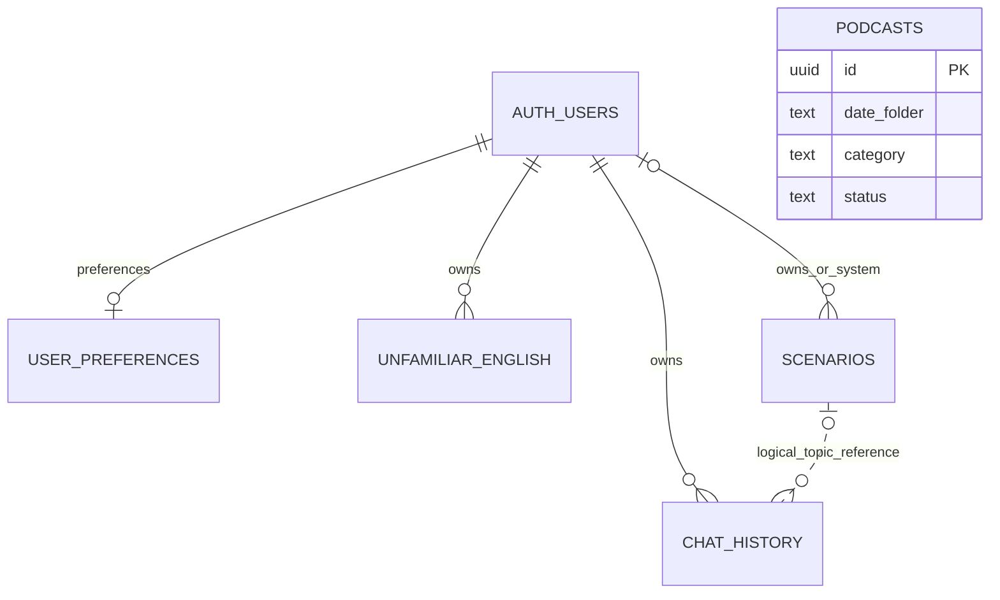

# 数据库与接口约定

状态：现状字典 + 变更提案。现有迁移文件是数据库结构的权威来源；本文不声明生产已执行这些迁移，也不包含可直接执行的新 SQL。

当前 AI 体验版调用独立的本机开发接口，未连接本文中的账号/数据库 API。其接口及本地 JSON v2 格式见 [10 AI 接入说明](10-ai-integration.md)，后续正式接入时需显式映射。

## 数据所有权与格式

| 数据 | 权威位置 | 客户端职责 |
| --- | --- | --- |
| 账号身份 | Supabase Auth；旧网页身份由服务端验证和映射 | Keychain 保存用户凭据 |
| 历史、学习项、语言偏好、场景 | Postgres，经业务 API 访问 | 显示、缓存和提交用户意图 |
| 未完成上传的消息 | 当前账号的本地待同步草稿 | 明确展示待同步，服务端确认后更新 revision |
| 实时音频 | 内存中的音频队列 | 使用后释放，基础版本不保存原始录音 |
| 播客文件 | COS；节目状态与文稿在 Postgres | 播放公开的已完成节目 |

数据库使用 `snake_case`；现有 HTTP API 同时存在 camelCase DTO 和原始 snake_case 行，先通过适配器明确映射，不能一次改名破坏网页。Swift 领域模型采用 camelCase，以显式 CodingKeys 处理异常字段。

ID 按字符串传输：表内 UUID 不等于所有 API 的 id。尤其当前播客 API 的 `id` 是 `YYYY-MM-DD`，不是数据库 `podcasts.id`。时间点用带时区的 ISO 8601/RFC 3339；日历日期独立使用 `YYYY-MM-DD`。客户端时间解析兼容有/无小数秒，统计请求显式传 IANA timezone。

未知可选字段应忽略，历史 JSON 中未知字段在重新保存时应尽量保留。不能把空字符串、null、字段缺失任意互换。写入的 owner 从服务端 principal 得到。

## 现有逻辑关系



图表示业务关系，不能当作所有生产 FK 均已验证的声明。`scenario:<uuid>` 是逻辑引用；旧 preferences owner 可能是 text，旧表中也可能有历史 orphan。

## 当前数据字典

### `user_preferences`

| 字段 | 类型 | 约束或含义 |
| --- | --- | --- |
| `user_id` | 新库 UUID；旧库可能 text | 主键；保持旧类型直到账号映射完成 |
| `native_language_code` / `learning_language_code` | text | 非空，语言目录内，二者不同 |
| `native_language_label` / `learning_language_label` | text | 非空展示标签；业务比较用 code |
| `created_at` / `updated_at` | timestamptz | 创建与更新时间 |

母语目录为 `zh-CN,en,ja,es,fr,de,ko,pt,it`，学习语言排除 `zh-CN`。默认学习 `en`、母语 `zh-CN`。RLS 允许当前 owner 查询、插入和更新。

### `chat_history`

| 字段 | 类型 | 约束或含义 |
| --- | --- | --- |
| `id` | uuid | 主键 |
| `user_id` | uuid | owner |
| `news_key` | text | 用户内主题身份；与 user_id 组成唯一键 |
| `news_title` / `summary` | text，可空 | 标题 / 摘要 |
| `news` | jsonb，可空 | 主题快照 |
| `history` | jsonb array | 消息、上下文；不保存 correction 类型 |
| `source_type` | text | `news` 或 `scenario` |
| `revision` | integer | 正数；数据库从 1 开始 |
| `created_at` / `updated_at` | timestamptz | 由服务端维护 |

索引以 `(user_id, updated_at DESC, id DESC)` 为主；按来源查询有对应索引。owner 有 RLS CRUD；写入 RPC `save_chat_history` 只允许 service role 执行，因此业务层必须先限定身份。

示例为当前消息格式，内容完全虚构：

```json
{
  "itemId": "00000000-0000-4000-8000-000000000001",
  "type": "message",
  "role": "user",
  "content": [{ "type": "input_text", "text": "Could you explain this headline?" }],
  "metadata": { "isFinal": true, "createdAt": "2026-09-29T13:00:00.000Z" }
}
```

assistant 的文字类型为 `output_text`；system context 也可能存在。旧消息可能使用字符串 content 或 `metadata.createAt`，读取兼容由适配器承担，不要求用户历史符合新 Swift struct 的所有必填字段。

### `unfamiliar_english`

| 字段 | 类型 | 约束或含义 |
| --- | --- | --- |
| `id` / `user_id` | uuid | 事件 ID / owner |
| `items` | jsonb array | 一次工具调用的一组学习项 |
| `context` / `user_message` | text，可空 | 语境 / 用户原句 |
| `learning_language_code/label` | text | 事件发生时的学习语言 |
| `native_language_code/label` | text | 事件发生时的母语 |
| `timestamp` / `created_at` | timestamptz | 业务时间 / 入库时间 |

`items[]` 为 `{text, type, meaning?, original?}`，type 为 `word|phrase|grammar|other`。新事件最多 20 项；读取旧事件不截断。索引含 owner、timestamp、id 和可选学习语言。RLS 只允许 owner 读和插入；这不是可随意更新“掌握度”的词典表。

### `scenarios`

| 字段 | 类型 | 约束或含义 |
| --- | --- | --- |
| `id` | uuid | 主键 |
| `category_slug` / `category_name_zh/en/ja` / `category_icon` / `category_sort` | text / integer | 分类快照 |
| `title_zh/en/ja` / `description_zh/en/ja` | text | 旧界面兼容字段，具体非空约束以 SQL 为准 |
| `title_target` / `description_target` | text，可空 | 学习语言主文案 |
| `target_language_code` / `native_language_code` | text | 语言对 |
| `difficulty` | text | beginner / intermediate / advanced |
| `system_prompt` | text | 角色设定；用户创建内容仍不可信 |
| `sort_order` / `is_active` | integer / boolean | 排序与启用 |
| `user_id` / `is_public` | uuid 可空 / boolean | NULL owner 为系统；用户场景可公开或私有 |
| `created_at` / `updated_at` | timestamptz | 时间点 |

系统场景有 `(category_slug,title_en,target_language_code,native_language_code)` 的条件唯一索引。公开读取要满足 visibility；个人修改只允许 owner。分类从 scenarios 派生，旧 `scenario_categories` 表保留兼容。

### `podcasts`

| 字段 | 类型 | 约束或含义 |
| --- | --- | --- |
| `id` | uuid | 数据库主键 |
| `date_folder` / `category` | text | 日期 / daily；组成唯一键 |
| `title` / `summary` / `script` | text，可空 | 标题、摘要、文稿 |
| `content` | jsonb，可空 | chunks、shownotes 等结构化内容 |
| `image_url` / `audio_url` | text[] / text，可空 | 图片与 MP3 地址 |
| `generation_id` | uuid | 生成租约身份 |
| `status` | text | in_progress / script_generated / completed / failed |
| `error_message` | text，可空 | 服务端失败原因，不作为 App 文案直接暴露 |
| `audio_bytes` / `audio_duration_seconds` | bigint / numeric，可空 | 文件大小与秒数 |
| `created_at` / `updated_at` | timestamptz | 发布相关时间 |

只公开 completed 节目。生成 RPC 和租约留在服务端；不能从 iOS 直接调用生成任务。

## 当前接口清单与原生适配

“登录”在本表表示现有 NextAuth 会话；Bearer 支持是待实现能力。

| 方法与路径 | 身份 | 当前输入/输出要点 |
| --- | --- | --- |
| `POST /api/auth/register` | 公开 | 邮箱注册；原生 Auth 流程还需邮箱确认/回调方案 |
| `GET /api/news?category=world` | 公开 | 成功是 RSS XML，失败为 JSON；category 有 allowlist |
| `POST /api/translate` | 登录 | 新闻标题翻译；明确复用现有请求格式 |
| `GET /api/scenarios` | 依查询而定 | categories/categorySlug/id/mine/public；单项为 object/null，列表为 array |
| `POST/DELETE /api/scenarios` | 登录 | 用户场景写入/删除，owner 由会话决定 |
| `POST /api/scenarios/generate` | 登录 | 生成草稿，不代表已经保存 |
| `GET/POST /api/user/preferences` | 登录 | GET data 为 snake_case object/null；POST `{native,learning}` |
| `POST /api/realtime-token` | 登录 | `{token}`；`Cache-Control: no-store` |
| `GET /api/chat-history` | 登录 | 列表含 nextCursor；`?id=` 单对象；`?newsKey=` 数组 0/1 项 |
| `POST /api/chat-history` | 登录 | newsKey、history、revision 等；409 带 current |
| `DELETE /api/chat-history?id=...` | 登录 | 删除当前用户的指定记录 |
| `GET /api/learning/items` | 登录 | targetLanguage、limit、before；列表 data + nextCursor |
| `POST /api/learning/items` | 登录 | items、context、userMessage、语言对；可能 skipped |
| `GET /api/learning/progress?timezone=Asia/Shanghai` | 登录 | 活跃天、轮次、streak、近七天和来源聚合 |
| `GET /api/podcasts?limit=50` 或 `?date=YYYY-MM-DD` | 公开 | 列表或单节目，包装 `{ok,data}` |

原生首期继续使用这些路径，建立逐接口的 DTO/适配器。不强行将 RSS、Token 和所有 JSON 包装成同一个泛型响应。未来需要破坏性变更时再启用版本路由，不能同路径改字段含义。

### 历史写入与冲突

当前兼容格式示例：

```json
{
  "newsKey": "scenario:00000000-0000-4000-8000-000000000002",
  "newsTitle": "Hotel check-in",
  "newsContent": null,
  "sourceType": "scenario",
  "revision": 0,
  "mergeOnServer": true,
  "history": [
    {
      "itemId": "00000000-0000-4000-8000-000000000001",
      "type": "message",
      "role": "user",
      "content": [{ "type": "input_text", "text": "I have a reservation." }],
      "metadata": { "isFinal": true, "createdAt": "2026-09-29T13:00:00.000Z" }
    }
  ]
}
```

首次写入 revision=0；更新使用最近服务端 revision。默认建议原生使用 mergeOnServer=true，仍处理 409，因为合并与写入之间可能发生并发。

```json
{
  "error": "This conversation was updated in another session",
  "code": "REVISION_CONFLICT",
  "current": null
}
```

`current` 实际可为最新历史详情。合并按 itemId，优先 final，再优先更完整文字；重试上限、删除后的迟到写入和旧账号队列均需测试。Web 与 server 的旧消息提取/去重细节存在差别，P0 用共享合成样例统一预期，不由 Swift 自行猜一种算法。

现有限制：请求 UTF-8 最多 1,000,000 bytes；history 最多 500 项；newsContent 最多 300,000 bytes；newsKey/title 最多 1000 个 JS 字符单位；summary 最多 10000。Swift 字符计数与 JS UTF-16 计数不同，最终校验以服务端为准。

历史列表 limit 默认 20、最大 50；学习项默认 50、最大 200。cursor 分别为 `updated_at|id` 和 `timestamp|id`，客户端作为不透明字符串传回，不截掉 id、不重算时间精度。

### 错误、重试和取消

401 触发受限刷新；403 显示无权限；404 资源已失效；409 走专门冲突流程；413 提示内容容量问题；429 根据 Retry-After 延后；5xx 可对幂等读取有限退避。新错误建议增加稳定 `code` 和 `requestId`，保留已有 `error` 字符串兼容网页。

GET 重试与写入重试分别设计。学习项写入未具备幂等键前，不允许因为超时无限重试。用户切页/筛选/账号时取消关联 Task；取消不能被显示为网络错误。

## 建议新增的数据契约

### 学习项幂等写入

新增可空 `client_event_id UUID` 与 `(user_id,client_event_id)` 的非空条件唯一约束，旧客户端省略时继续工作。原生在第一次入队时生成 ID，重连/重试复用；服务端同 ID 同 payload 返回同一记录，同 ID 不同 payload 返回冲突。不能仅用不同 Live session 的 callId 当全局唯一键。

迁移需补上最小权限、生产 fixture 和重复提交测试。API 支持上线后，客户端才打开自动重试。客户端看到 accepted 但未持久化时，继续显示待同步。

### 语言与主题身份的迁移决策

推荐首版延续“一个用户、一个主题、一条累计历史”的既有语义，并在**新消息** metadata 增加 `learningLanguageCode`、`nativeLanguageCode` 和 `practiceRunId`。`practiceRunId` 表示一次练习尝试；这只是提议的新字段，旧消息没有这些数据。

切换语言时结束旧 Live 会话；新会话只使用语言对一致的最近连续练习片段作为续聊上下文。未知语言的旧内容仍能阅读，但不能自动标为当前语言并发送给模型。保存时服务端合并保留整个主题历史，不能用筛选后的片段覆盖数据库。

P0 审计历史快照与消息形状，确定是否有足够信息识别语言；没有证据就保留 unknown。Web 后续写入也要带同样的 metadata，避免两端持续产生无法区分的消息。若产品选择“同一新闻分语言独立会话”，另写 ADR 和有版本的数据/API 迁移；不能仅由 iOS 改 `news_key`。

长期稳定新闻 ID、按次练习、分支重试和故事进度，都应独立建模；保留现有 key 的映射，避免让旧历史失联。详见 [产品创意提案](08-product-ideas.md) 的数据影响。

### 账号删除与 AI 数据授权

拟新增账号删除业务入口，完成重新认证、当前 owner 核查、关联数据删除或约定的保留处理，以及身份会话撤销。路径和是否异步作业在实现前锁定；普通客户端不能获得 Supabase Admin 权限。

AI 授权记录建议包含政策版本、授权时间、撤回时间和账号；具体保留期与跨端同步规则待隐私方案确定。设备麦克风系统权限独立处理。不能宣称“音频不出设备”或“第三方绝不留存”，因为实时对话会发送给模型服务。

## 本地格式提案

```json
{
  "schemaVersion": 1,
  "ownerId": "00000000-0000-4000-8000-000000000003",
  "newsKey": "example-topic-key",
  "baseRevision": 3,
  "updatedAt": "2026-09-29T13:00:00.000Z",
  "pendingHistory": [],
  "pendingLearningEvents": []
}
```

此为字段说明示例；空数组不构成需要上传的真实练习。文件写入采用临时文件与原子替换；损坏文件隔离并提示，不能让整个 App 启动失败。每次本地结构变更增加 schemaVersion 并提供迁移；Token 不包含在该文件内。

## 数据迁移与回退

现有 001–007 按顺序执行，新需求使用新 migration，不修改已部署迁移的含义。依照根 AGENTS：先 preflight，BLOCKER 为零才进入迁移；检查生产等价 fixture、隔离测试、备份与恢复方案；执行后对比 postflight 和数据行数。

使用“新增字段/能力 → 兼容两端 → 验证使用情况 → 后续清理”的顺序。服务端回滚时优先关闭新能力并保留新增数据，不能靠删除新列恢复旧版本。生产迁移未核实前，不移除旧表名、旧 API 别名或 fallback。
