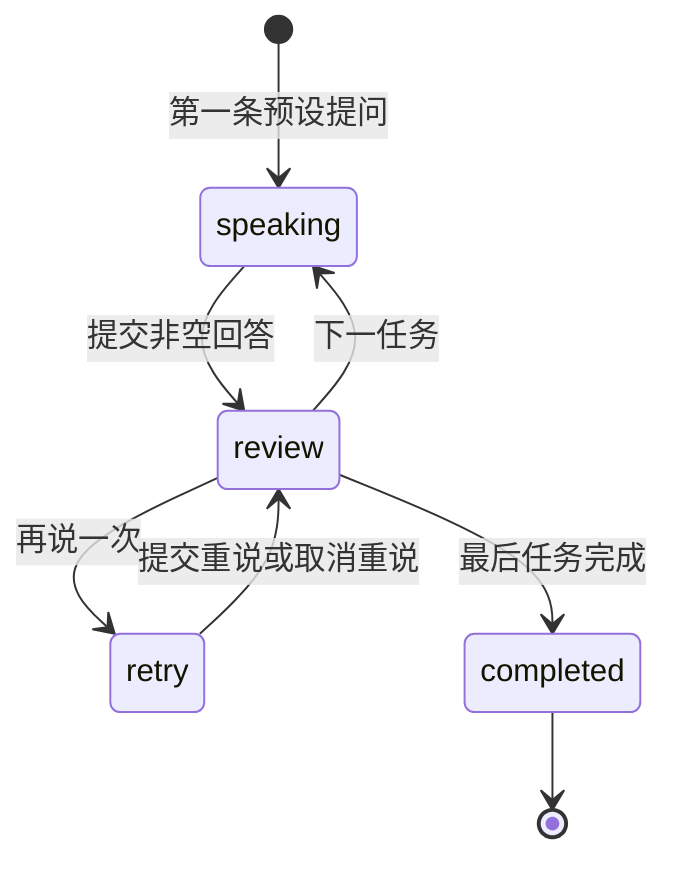

# iOS 交互体验版 0.1.0

> 历史记录：下文描述第一轮预设对话原型。当前已升级为真实 Gemini AI 体验版 0.2.0，最新实现、运行方式和验证结果见 [10 AI 接入说明](10-ai-integration.md)。

日期：2026-09-29。用户已选择「先试交互原型：免登录体验明日预演＋一句话重来，记录保存在本机」。本轮将创意 A/B 做成无后端依赖的原生交互原型。最低部署版本为 **iOS 15.0**。

这次交付用于体验流程、文案和操作节奏。它还不能证明 AI 对话质量、语言能力提升、用户留存或付费意愿。真实核心闭环仍按 [实施计划](05-delivery-plan.md) 推进。

## 交付范围

| 页面/能力 | 当前行为 |
| --- | --- |
| 练习首页 | 品牌入口；全部/职场/旅行/日常筛选；4 个本地场景 |
| 明日预演 | 选择场景；填写个人目标和背景；查看三步任务 |
| 场景内容 | 延期沟通、酒店换房、面试追问、点单变化；各 3 个任务 |
| 对话 | 固定英文提问；可显示中文；文字输入；按按钮推进下一任务 |
| 分层提示 | 先给沟通意图，再给关键词，最后给参考句；不会自动提交 |
| 一句话重来 | 保留原回答和每次重说；可取消重说并保留原答案；不会计算分数 |
| 语音 | 系统英文朗读；支持设备可申请设备端英文听写；拒绝权限或不支持时可继续打字 |
| 完成页 | 展示真实任务数、表达次数、主动重说次数；可收藏参考表达 |
| 学习 | 本机历史、完整文本、继续未完成练习、再练一次、删除单次记录；收藏与取消收藏 |
| 我的 | 跟随系统/浅色/深色；体验范围和本地数据说明 |

对话与参考表达均为预设，明确标注在界面中；用户目标、背景是自己的提醒，**不会驱动生成或改变对方回答**。系统不会根据输入进行纠错或判断任务是否真正沟通成功。点击「完成」代表走完练习流程。

未接入：Gemini、远端新闻/场景、账号、Web 历史/生词同步、订阅、分析埋点、推送、播客或能力评分。App 没有新增 HTTP/WebSocket 请求或供应商密钥。

## 设计落地

沿用 [设计规范](02-design-system.md) 的紫色、偏紫中性色、轻量渐变和圆角卡片。颜色集中在 [Brand.swift](../../ios/LingDaily/LingDaily/DesignSystem/Brand.swift)，提供深浅两套；文字使用系统字体，核心正文和标题跟随 Dynamic Type。

底部三个入口为「练习 / 学习 / 我的」。完整练习通过全屏页面打开，避免切换 Tab 时丢失语音状态。提供正常、空记录、输入为空、音频失败、保存失败、未完成和完成状态。没有填充虚构练习历史或学习进步数据。

## 实际代码结构

```text
ios/
├── LingDaily/LingDaily.xcodeproj       # 唯一 App target，SwiftUI，iOS 15
├── LingDaily/LingDaily/
│   ├── LingDailyApp.swift             # App 生命周期、主题和 Store 注入
│   ├── App/                          # Tab 入口、PracticeStore
│   ├── DesignSystem/                 # 语义颜色、卡片、按钮、空状态
│   ├── Core/Models/                  # 值类型、练习状态与本地归档
│   ├── Core/Persistence/             # JSON 原子保存和版本检查
│   ├── Core/Audio/                   # 系统朗读、设备端识别、取消及中断
│   └── Features/                     # Practice / Learning / Settings
├── Package.swift                     # 复用纯 Foundation 源码的测试入口
└── Tests/                            # 状态转换、重说、归档恢复和异常文件测试
```

没有增加第三方依赖。`PracticeSession` 管状态变化，SwiftUI 管临时草稿与焦点，`PracticeStore` 管归档，`SpeechController` 管系统音频。该结构服务于当前小规模原型；真实 Live 接入时按架构方案增加网络、身份和同步边界。



只有提交过用户文字的练习才进入历史。重说追加独立消息，不覆盖原文；每次新练习获得新 UUID，继续练习复用原 UUID。未发送草稿只在内存，退出确认会提醒不保存草稿。

## 本地文件格式 v1

位置：App 沙箱 `Application Support/LingDailyExperience/archive-v1.json`。只属于体验版，**不是** [正式 API DTO](04-data-contracts.md)，不能直接上传到 `chat_history`。

| 字段 | 类型与约定 |
| --- | --- |
| `schemaVersion` | 整数，目前为 `1`；未知版本停止读取/覆盖 |
| `sessions[]` | `id` UUID、完整 `scenario` 快照、`personalGoal`、`context`、创建/更新时间、`stepIndex`、`phase`、`messages[]` |
| `scenario.steps[]` | `id / goal / prompt / translation / hint / keywords / expression / meaning` |
| `phase` | `speaking / review / retry / completed` |
| `messages[]` | UUID、`role: partner/user`、`kind: prompt/answer/retry`、`text`、`stepIndex`、`createdAt` |
| `expressions[]` | 规范化文本作为 `id`，以及 `text / meaning / source / createdAt` |
| 日期 | 此内部文件使用 Foundation Codable 默认 Date 数值：距 2001-01-01 00:00:00 UTC 的秒数，保留小数；不等于 Unix 时间戳 |

```json
{
  "schemaVersion": 1,
  "sessions": [],
  "expressions": []
}
```

每次已发送消息、阶段变化或收藏变化后原子写入。记录按更新时间倒序，同一练习 upsert；表达去除首尾空白并转小写去重。目标最多 100 字符，背景 500，单次回答 800。

归档使用系统文件保护并排除备份，不写日志；不保存原始录音。解码失败、未知版本或越界步骤会保留原文件并显示错误，当前运行禁止覆盖它。临时写入失败显示未保存提示，可重试。卸载或删除本机记录后无云端副本可恢复。

当前记录规模小，整份 JSON 在主线程同步保存；这不是面向大量历史的存储方案。增加真实同步或大量记录前需要串行后台 I/O、分页/拆分、迁移与容量策略。真实账号接入时先设计本机体验数据的归属/导入，不能直接归到登录用户。

## 音频与隐私边界

- 用户点麦克风后才申请 Speech 和麦克风权限；支持能力不满足时提示打字。
- 听写固定 `en-US`，先检查 `supportsOnDeviceRecognition`，请求设置 `requiresOnDeviceRecognition = true`，不回退云端识别。
- 识别最长 45 秒，可手动停止；识别文字可修改后发送。
- 朗读和录音互斥。页面退出、App 非活跃、系统音频中断和耳机断开时停止音频。
- 异步权限与识别使用 generation 标识，忽略上一轮的迟到结果。
- 真实 Gemini 双向语音需要独立验证权限说明、延迟、回声、打断和数据去向；系统听写不能替代该验收。

## 验证与已知限制

运行入口与命令见 [iOS README](../../ios/README.md)。

- 已完成 Xcode 27.0（27A266a）/ iOS 27 SDK 的模拟器 Debug 构建，产物 `MinimumOSVersion` 为 15.0；安装并启动到 iPhone 16 Pro / iOS 18.6。通过 Xcode 视图调试器观察到实际首页，标题、预演卡片和场景入口正常显示。
- `swift test --package-path ios`：**9 项测试全部通过**。覆盖空/过长输入、重复提交、重说保留原句、取消重说、顺序完成、归档去重、收藏去重、落盘恢复、损坏文件、未知版本和越界数据。
- 本机 Device Hub 的 UI 自动化持续超时，重启后仍无法可靠读取窗口；**完整模拟器交互、多页面视觉检查尚未完成**。首页视图快照及启动成功不代表全流程点测通过。
- 尚未在 iOS 15 真机/运行时验证；也未验证真实麦克风、TTS 出声、蓝牙、来电、VoiceOver、最大字号、横屏和 iPad 布局。模拟器默认使用键盘体验。
- 尚未配置真机签名、TestFlight、App Store 元数据或收费。

建议这次先体验：选场景 → 输入目标 → 回答 → 看分层提示/参考句 → 重说 → 收藏 → 完成 → 从学习回看。重点反馈「是否愿意为明天的真实沟通先练一遍」「重说是否有用」「参考句是否打断节奏」。
