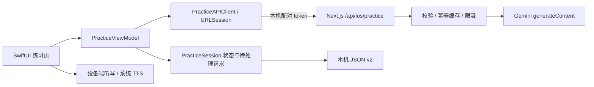

# AI 体验版 0.3.0：目标、交付与运行

更新：2026-09-30。0.3.0 按用户反馈（界面“AI 感太重、不够吸引人、用起来别扭”）重做了全部界面，AI 能力、接口与本机存储格式不变；视觉原则与组件见 [02 设计语言](02-design-system.md)。2026-09-29：用户明确要求接入真实 AI；当前新练习已使用 **Gemini 2.5 Flash** 生成开场、接话、提示与针对原句的重说反馈。此文取代 09 中关于「当前版本只有预设对话」的描述；09 保留为第一轮原型记录。

## 用户的目标

1. 将现有 LingDaily / talk-news 做成原生 iOS App，最低支持 **iOS 15**。
2. 先研究并写好重构文档，统一设计语言、页面模板、架构、数据格式和开发协作方式。
3. 首版优先完成「新闻/场景 → 语音练习 → 历史与生词」，播客和进度后置。
4. 探索有吸引力的新交互、场景与故事，形成回访和付费的理由；先体验「明日预演 + 一句话重来」。
5. 当前要拿到能和真实 AI 练习的版本，不能停留在固定脚本演示；暂时免登录、记录保存在本机。

## 实际完成了什么

| 范围 | 已完成 | 当前边界 |
| --- | --- | --- |
| 项目与设计 | Xcode 原生 SwiftUI 工程、最低部署 15.0、三个 Tab、语义色、深浅主题、页面/任务/ADR 模板 | iOS 15 运行时与真机仍待验证 |
| 研究文档 | 现状、设计、架构、数据库/API、实施顺序、Agent 协作和 8 个产品创意 | 商业判断仍是假设，没有留存或付费验证 |
| 明日预演 | 4 个场景起点，个人目标/背景进入真实模型上下文，三步练习 | 任务结构来自本地场景，暂不生成全新任务列表 |
| 真实对话 | 文字模式逐轮 Gemini HTTP；新增语音通话模式 Gemini Live 双向音频、字幕、纠错、收词、工具推进任务 | 开发配对入口；英文练习、中文教练；正式认证未接入 |
| 一句话重来 | AI 对刚才的用户回答给出自然表达与解释；每次重说单独保留 | 文字反馈，不评估发音，也不提供能力分数 |
| 音频 | 文字模式设备听写/系统 TTS；Live 使用 AVAudioEngine、语音处理、16 kHz PCM 上行、24 kHz 模型音频下行 | Live 音频直传 Gemini，不保存原始录音；实际麦克风、听感和路由待人工验证 |
| 学习记录 | 本机历史、续练、AI 原文/翻译/反馈、表达收藏、删除 | 未与 Web 账号、历史或生词同步 |
| 连接 | Mac 上的受配对保护的 Next.js 开发 API，模型密钥仅服务端持有 | 模拟器默认回环连接；显式device模式可供Debug真机局域网体验，生产强制关闭 |

尚未完成的核心项：原生账号/认证、新闻接入、云端同步、生词复习、真机音频验收/TestFlight、订阅支付。不能把本轮交付当成完整首发版或已上架产品。

## 现在怎么试

在仓库根目录启动本机服务（已经运行时无需再启动一份）：

```bash
npm run ios:dev
```

保持服务运行，打开 `ios/LingDaily/LingDaily.xcodeproj`，选择 **LingDaily / Debug / iPhone 模拟器**，按 `⌘R`。

推荐体验路径：

1. 首页点 Alex 的场景卡（「把延期说清楚」）→ 目标填「我想把交付时间协商到周四」，点「补充一点背景」写「供应商周三才给数据」。
2. 点「开始对话」；先看到「正在回复」，然后收到实际模型开场。
3. 用英语打字或设备端听写，发送自己的意思；卡住时点底部「提示」的「意思 / 关键词 / 参考说法」。发送后对方接话，针对该句的「更自然的说法」出现在你的气泡下方。
4. 点「再说一次」，发送另一个版本；原话、重说和两次建议分别保留。
5. 收藏有用表达，点「下一步」；完成或中途离开后，首页会出现「继续和 Alex 的对话」，也可到「学习」回看。

首次运行时，`npm run ios:dev` 从既有 `.env*` 读取 Gemini 配置，生成被 Git 忽略、权限为 `0600` 的 `.ios-dev/connection.json`。它只有本机地址与随机配对 token，没有 Gemini API Key。Xcode 的构建阶段在 **Debug + Simulator** 将该文件复制进 App；Debug真机只复制显式device模式生成的独立文件，Release一律移除配对配置。删除或重新生成配对文件后需重新构建。

本次核查中，既有网关连接被重置，官方 Gemini 地址实际调用成功。因此 `ios:dev` 仅为此功能设置 `GEMINI_PRACTICE_BASE_URL=https://generativelanguage.googleapis.com`，不改写 `.env` 或已有 Web/Gemini 配置。可通过显式 `GEMINI_PRACTICE_BASE_URL`、`GEMINI_PRACTICE_MODEL` 覆盖。2026-10-02当前Key对2.5-flash的generateContent返回404，3.1-flash-lite实测可用；ios:dev进程现默认后者，不修改网页默认模型或.env。

默认只监听 `127.0.0.1:8000`。iPhone真机需在同一可信Wi-Fi运行 `npm run ios:dev -- --device`，再从Xcode重新安装Debug版；脚本只绑定一个RFC1918私有IPv4接口，生成0600的`.ios-dev/device-connection.json`。客户端只允许端口8000、根路径、无URL凭据/查询的回环或显式配对私网地址，拒绝公网站点和手机自身localhost，HTTP重定向仍禁用。普通启动删除真机配对文件。此开发模式通过本地HTTP传输配对凭据；不用于公共网络、TestFlight或生产。正式版本仍需HTTPS与正式认证。

App包含`NSLocalNetworkUsageDescription`，URLSession开启`waitsForConnectivity`以等待权限交互。首次练习允许「本地网络」，语音通话再授权麦克风；拒绝后可到系统设置开启。Debug专用Info.plist声明本地联网，并为iOS17+的数字IP连接添加三个RFC1918私网CIDR的ATS例外；Release使用原有Info.plist，不含这些IP例外，没有新增`NSAllowsArbitraryLoads`；Gemini WebSocket仍为受白名单限制的官方WSS地址。[Apple本地网络说明](https://developer.apple.com/documentation/technotes/tn3179-understanding-local-network-privacy)、[本地ATS例外](https://developer.apple.com/documentation/bundleresources/information-property-list/nsapptransportsecurity/nsallowslocalnetworking)

## 实际架构



- 领域状态：[PracticeModels.swift](../../ios/LingDaily/LingDaily/Core/Models/PracticeModels.swift)、[AIPracticeModels.swift](../../ios/LingDaily/LingDaily/Core/Models/AIPracticeModels.swift)。
- 网络与请求生命周期：[PracticeAPIClient.swift](../../ios/LingDaily/LingDaily/Core/Network/PracticeAPIClient.swift)、[PracticeViewModel.swift](../../ios/LingDaily/LingDaily/Features/Practice/PracticeViewModel.swift)。
- 接口与模型：[route.js](../../app/api/ios/practice/route.js)、[iosPractice.js](../../app/lib/server/iosPractice.js)、[输入/输出契约和提示词](../../app/lib/ios/practice.js)。
- 本机启动：[ios-dev.mjs](../../scripts/ios-dev.mjs)。

仍是一个 App target 和现有 Next.js 服务；未引入 Agent 框架或多 Agent 业务调度。

## 账号与认证（2026-10-05）

原生 App 默认连线上 `https://lingdaily.yasobi.xyz`，不再需要 Mac 运行 `ios:dev`。认证用 Sign in with Apple：

1. App 生成 32 字节随机 nonce，把它的 SHA-256 写入 Apple 请求，要求 `email / fullName`。
2. `POST /api/ios/auth/apple` `{ identityToken, nonce, fullName? }`：服务端用 Apple JWKS 校验 RS256 签名、`iss=https://appleid.apple.com`、`aud=APPLE_IOS_BUNDLE_ID`（默认 `com.qcy.LingDaily`）、过期时间，并核对 `nonce == sha256(raw)`；要求 Apple 已验证的邮箱（隐藏邮箱也可以）。
3. 按邮箱调用与网页 OAuth 共用的 `ensureAuthUser()`（`app/lib/server/supabaseAuthUser.js`）得到 Supabase UUID；拿不到时返回 503，不签发会话。
4. 返回 `{ sessionToken, expiresAt, account: { email, isPrivateEmail } }`。会话是 HS256 JWT（`iss=lingdaily`、`aud=lingdaily-ios`、`sub=Supabase UUID`、60 天），密钥由 `AUTH_SECRET` 经 HKDF（info `ios-session-v1`）派生，网页 NextAuth cookie 不能当作 iOS 会话使用。
5. App 把会话存进 Keychain（`AfterFirstUnlockThisDeviceOnly`，不同步 iCloud），之后对 practice / scenario / live-token 发送 `Bearer <session>`。401 时自动删除并回到未登录；启动时检查 Apple 凭证状态，撤销后本机退出。

会话无服务端吊销列表；更换 `AUTH_SECRET` 会使全部 iOS 会话失效。练习记录仍只在本机，账号目前只用于保护模型额度和为后续云同步建立身份。缓存与限流按 Supabase UUID 隔离（每用户并发 2、文字/场景 20 次/分钟、Live token 6 次/分钟，单进程内存）。App Store 上架前还需账号删除入口（审核指南 5.1.1(v)）。

`npm run ios:dev` 仍可用于调试服务端改动：只在该进程运行期间生成配对文件，Debug 构建打包后改连 Mac 且免登录；进程退出即删除配对文件。生产拒绝配对 token。

## 中文翻译与 Live 续聊（2026-10-05）

对方每句话都显示「中文」。文字模式回复自带 `translation`；Live 字幕没有翻译，首次点开时调用 `POST /api/ios/translate { requestId, text≤1000 }`（同一模型、文本只作数据传入），结果写入该消息的 `translation` 并更新 `updatedAt`，随云同步保存，之后不再请求。对话页与记录回看页共用 `BubbleTranslations`。

Live 建立后的开场信号由 `LiveKickoff` 决定：新会话请对方开场；对方最后一句尚未回答（从文字切到语音或重连）时不发任何信号，等学习者先说，避免模型把上一句问题再问一遍；学习者最后说话时请对方接着回应，且不再打招呼、不重复。服务端 Live 指令同样要求续聊时不重复已说内容。

## 外放回声与角色串位（2026-10-05）

真机截图确认了回声（用户全程未说话，学习者气泡是纯回声）：扬声器外放时 Voice Processing 消不净 Alex 的声音，残余被 Gemini 服务端语音检测当成学习者说话——开场被打断（停在“about”），回声被转写成学习者气泡（“AlexYou want something”）。`LiveEchoGate` 只在输出为机身扬声器/听筒、且对方音频排队/播放中（及之后 0.35 秒余音）时工作：低于语音门槛的帧视为回声残余，替换为等长静音；门槛 = max(0.02, 实测回声底噪 × 6)，底噪只用被判为回声的帧做指数平滑自动校准；连续 3 帧（60ms）高于门槛即判定学习者在说话，按顺序放出这 3 帧并在其后 300ms 内持续放行，保留打断能力。耳机/蓝牙完全不处理。门槛数值未经真机采样验证：Debug 加 `LINGDAILY_LIVE_DIAGNOSTICS=1` 时诊断行会输出 `echoLevel / speechThreshold / speaker` 供调参。

同一截图里模型开场就说学习者的台词（“Hey Alex, do you have a minute…”）。原因是背景用中文写给学习者、称其为“你”，开场信号又没说明身份。现在 `LiveKickoff` 的开场与续聊信号都写明“You are <partner>; I am the learner”，Live 与文字的系统指令都说明背景里的“你”永远指学习者。

## 云同步与删除账号（2026-10-05）

iOS 不另建存储，**复用网页已有的 Supabase 表**，同一账号在网页与 App 看到同一份数据（迁移 `202610050001_native_practice_sync.sql`）：

| iOS 本机 | Supabase | 网页可见性 |
| --- | --- | --- |
| 练习 `PracticeSession` | `chat_history`，`source_type='practice'`，`news_key='practice:<session uuid>'`；`news.session` 存完整会话，`history` 派生为网页消息格式 | 历史列表显示“App 练习”（只读，不能在网页续聊），计入进度与连续天数 |
| 词库/收藏 `SavedExpression` | `unfamiliar_english`，每条一行，id 由用户与文本确定性派生；收藏句 `type='other'` | 网页生词本可见；网页 Live 收集的生词也会同步到 App |
| 自建场景 | `scenarios` 私有用户行 + `practice_plan`（完整三步计划），并生成英文 `system_prompt` | 网页场景列表可用 |

`/api/ios/sync`：`POST { sessions/expressions/scenarios: { upsert, delete } }` 先应用改动再返回快照；`GET` 只取快照。会话以 `updatedAt` 防旧覆盖新；单条无效/过大的会话放进 `rejectedSessions`，不让整批卡死。只同步 en/zh-CN 学习项。缓存/限流按用户，单次请求 ≤4MB。

App 端 `SyncLedger`（Core/Persistence/CloudSync.swift，纯逻辑有单测）显式记录 synced/dirty/deleted，不靠时间戳比较；`SyncEngine` 在登录、回到前台和本地修改后 4 秒同步。首次登录把本机已有记录上传进该账号；本机数据属于另一个账号时先清空再下载，绝不跨账号上传。退出登录先尝试上传，仍有未同步内容时提示，确认后清除本机记录（重新登录从云端恢复）。

删除账号（审核指南 5.1.1(v)）：「我的」→ 删除账号 → 说明后用 Apple 再确认一次；服务端核对确认的 Apple 邮箱属于当前账号，再删除 `chat_history / unfamiliar_english / scenarios / user_preferences` 中该用户的行并删除 Supabase auth 用户（网页账号同时删除），最后清空本机。配置 `APPLE_TEAM_ID / APPLE_SIGNIN_KEY_ID / APPLE_SIGNIN_PRIVATE_KEY` 后会用确认时的 authorization code 撤销 Apple 授权；未配置时跳过撤销，不阻塞删除。

## HTTP 契约 v1

`GET /api/ios/practice` 检查配对与服务配置，返回 `ok / model`；它不调用模型，不能作为供应商在线证明。

`POST /api/ios/practice`：JSON，`Authorization: Bearer <iOS 会话或本机配对 token>`，`Cache-Control: no-store`。

| 请求字段 | 约定 |
| --- | --- |
| `requestId / sessionId` | UUID；同一次待处理操作重试必须复用 requestId |
| `action` | `start / answer / advance` |
| `stepIndex` | 当前任务，0–2 |
| `goal / context` | 用户目标 ≤100 字符、背景 ≤500 |
| `scenario` | title、partner、partnerRole、setting、3 个 goals |
| `messages` | 最近最多 24 条；role 为 partner/user，kind 为 prompt/answer/retry/response，附 text/stepIndex |

| 成功响应字段 | 约定 |
| --- | --- |
| `requestId / model` | 原样关联请求；返回实际模型版本 |
| `data.reply / translation` | 对方真实回复及中文翻译 |
| `data.hint / keywords` | 当前任务的意图提示与关键词 |
| `data.suggestedReply / suggestedMeaning` | 当前语境的示例表达及中文含义 |
| `data.feedback` | start/advance 为 null；answer 为 revised/meaning/note，明确从用户视角改写原句 |
| `data.feedback.items` | 0–3 个 `{ text, type: word\|phrase\|grammar, meaning }`：仅当用户这句用中文代替、表达出错或主动询问时才收录，流利正确时为空。形状与网页 `unfamiliar_english.items[]` 一致；缺省按空数组处理 |

失败返回 `code / message`：400 无效输入、401 未登录/会话失效/配对失效、409 requestId 内容冲突、413 过长、415 非 JSON、429 限流/供应商繁忙、502 模型不可用或回复无效、503 未配置。不会把失败替换成固定台词或返回原始供应商错误。

### 新场景 `POST /api/ios/scenario`

同一认证边界与限流（独立计数）。请求 `{ requestId, description ≤300 }`；成功返回 `{ requestId, model, scenario }`，`scenario` 含 title、subtitle、category（职场/旅行/日常/学习/社交）、partner、partnerRole、setting 与恰好 3 个 step（goal、prompt、translation、hint、keywords、expression、meaning）。描述只作为数据传入，系统提示不拼接用户文本；步数或长度不符时纠正生成一次，仍失败返回 502。服务端不保存场景，App 为其分配 `custom-<UUID>` 并存入本机。

## 与 Gemini Live 的关系

2026-09-30 新增「语音通话」，文字流程保持原有 HTTP 接话/设备听写/TTS。语音模式通过本机开发接口签发一次性受约束 token，App 直连官方 Gemini WebSocket；不调用网页 `/api/realtime-token`，不改变 Web Live、生产行为或数据库。

### `POST /api/ios/live-token` 契约

仅 `development` + `IOS_PRACTICE_DEV_ENABLED=1` + 本机配对 Bearer 可用，生产强制 404。复用 `authorizeDevelopmentPractice / readBoundedJSON / practiceJSON / practiceFailure`；正文最多 48 KiB，非 JSON 415。Zod strict 拒绝任意额外字段，包括客户端 model、wsURL、tools 和 systemInstruction。

请求：`scenario { title ≤100, partner ≤80, partnerRole ≤100, setting ≤1000, goals: 恰好3个非空字符串≤200 }`；可选 `goal≤100 / context≤500 / stepIndex:0..2 / messages:最近最多12条 {role:user|partner,text≤2000}`。后两项用于用户手动重新连接时提供背景，不是供应商会话恢复。

响应：`{ token, model, wsURL, expiresAt }`，`Cache-Control:no-store`。`token` 是临时凭据，App 只在内存使用；无 Gemini Key 或配对凭据回传。模型来自 `GEMINI_LIVE_MODEL`，默认 `gemini-3.1-flash-live-preview`；token仍从官方签发端点取得，WebSocket由服务端的`GEMINI_LIVE_WS_BASE_URL`选择官方地址或受控中转（见本节末尾）。独立于网页代理配置，客户端不能指定地址。开发签发最多2个并发、每分钟6次；不缓存或合并 token（`uses:1` 不可复用）。这约束签发频率，不是语音会话的可信计费配额。

`@google/genai` 现有 SDK 的 `CreateAuthTokenConfig.liveConnectConstraints = { model, config }` 用于锁定模型和 Live 配置；省略 `lockAdditionalFields` 使用 SDK 的全部配置锁定行为。锁定 AUDIO、Aoede、服务端 systemInstruction、工具、双向转录和自动 VAD。`uses:1`，有效30分钟，新建连接窗口2分钟，v1alpha constrained endpoint。中文教练规则放入服务端指令，所有客户端场景/目标/背景/字幕和用户语音明确作为不可信练习数据。签发失败不会降级成无约束 token。

官方当前[临时 token 文档](https://ai.google.dev/gemini-api/docs/live-api/ephemeral-tokens) 已使用 v1beta；本机已安装 SDK 文档仍声明受约束 token v1alpha-only。这里保留现有 SDK/网页 v1alpha 协议，并已真实验证。另一次篡改 setup 的模型、系统提示、响应模态和工具，仍得到锁定模型的 AUDIO 与白名单工具，证明这些关键字段在实测中生效。未逐一穷举所有供应商可选配置；工具执行、任务进度、长度与保存仍由 App 校验，token 不替代业务验证。供应商允许后续 clientContent 是 Live 的正常功能，不能把 token 约束误解为阻止用户说出任意内容。

### 原生链路与可靠性

- `Core/Realtime/LiveProtocol.swift`：明确消息编解码、全事件解析、工具校验、字幕稳定 UUID 合并、generation、有界播放缓冲、20ms PCM 分帧。
- `Core/Realtime/LivePCMConverter.swift`：实际 AVAudioConverter（与 Package 测试共用），设备原生格式→16 kHz 单声道 PCM16 LE。
- `Core/Network/LiveWebSocketClient.swift`：URLSessionWebSocketTask；单接收/写入/上传泵，WebSocket消息≤512 KiB，写队列≤50；setup超时20秒。只允许服务端固定官方地址，URL和供应商异常不打印/不显示。
- `Core/Audio/LiveAudioController.swift`：按钮内同步准备输出；`.playAndRecord + .voiceChat`，采集启用 Voice Processing。只有 setupComplete 后装输入 tap。tap仅try-lock复制到8个预分配4096帧缓冲；LiveMicrophonePipeline把超过4096帧的硬件回调拆成多个槽，转换、分帧放串行worker。上传PCM队列≤50帧（约1秒），每帧640 bytes；上传泵每次唤醒排空等待帧，再等20ms。采集/上传压力丢弃有界音频并提示，不结束通话；网络队列优先保留控制和工具ack。
- 播放24 kHz PCM16，由 AVAudioPlayerNode 顺序调度；预留字节包含尚未dispatch和已调度音频，总计≤480000 bytes（10秒）且≤256块；超过上限丢弃新音频块并提示，空块忽略，不结束通话。输出不可用先排队，prepare/startCapture后补播。interrupted立即清队列并增加playbackGeneration，旧completion也不能修改新队列。
- `Features/Practice/LivePracticeController.swift`：ObservableObject/MainActor，连接/静音/播放分开；connectionGeneration覆盖token等待、socket事件、错误和异步工具；旧close使用expectedGeneration，不能关闭新socket。
- 工具仅 `record_language_correction / record_unfamiliar_learning_items / mark_task_complete`，参数≤8 KiB。通过白名单/类型/长度校验后先排队ack accepted，再异步处理；未知/无效工具ack rejected。重复id不重复执行，toolCallCancellation失效未执行工作。任务只能推进当前index且必须已有该任务用户句，不能跳步。
- 字幕按角色/轮次UUID更新同一气泡；保留重复增量词，finished封存文字；打断后的旧partner turnComplete保留正在进行的用户字幕。空白字幕不进入历史，请求也过滤旧空白记录。纠错忽略标点，支持句中引用和小幅STT差异，近12句择优关联用户UUID；转录未到时有界等待，无关引用不挂错句。完成Live任务后切文字用advance请求当前任务，避免把上一步原句当当前回答。归档在最终字幕/轮次/工具事件合并400ms写入，结束立即保存；收词只调用一次 `store.save(_:collecting:)`，去重且不覆盖手动收藏。磁盘写入仍在MainActor，未改整体持久化架构。
- 静音仅停止麦克风帧，清已排队输入并发送audioStreamEnd，输出继续播放。后台、来电/Siri中断、设备断开或无可用路由、媒体服务重置停止采集/连接、保存已有内容；新增耳机/蓝牙或路由配置变化只在采集中重新检查格式并重建converter/tap，categoryChange忽略，保持连接和静音状态；回前台不自动开麦。用户点重新连接才重新检查权限和硬件格式。麦克风拒绝有中文提示，可切文字。

字幕、批注和学习项保存在本机；结束不保存原始PCM/token。Live没有会话恢复句柄，不自动重连，goAway提示用户重新连接；重新申请token后用最近文字和当前任务开始新会话，不能保证供应商记住之前未转录的语音。Release不打包本机配对文件，因此当前Release不提供正式Live连接。最低iOS15，无第三方App依赖。

## 状态、幂等与反馈质量

- 新练习没有预置开场消息：先等待模型；输入、重说、推进均受 pending 状态约束。
- 用户发送后立即保存原文与 pending requestId。失败可重试同一请求，重启后可继续，不再追加重复用户消息。
- Swift 校验响应 requestId，ViewModel 用 generation 标记忽略取消/退出后的迟到结果；切后台暂停等待，重试由用户发起。
- 反馈关联具体用户消息 UUID，重说产生新记录；完成页收藏来自实际 AI 建议。
- 明确区分 LEARNER 与 ROLEPLAY_PARTNER，模型先生成用户反馈，再生成角色回复；校验反馈不能直接复制对方回复。格式/角色校验失败最多进行一次纠正生成，仍失败则显示重试。
- 文本格式和这条复制检查不能保证所有语义错误都被发现，界面仍将其标为 AI 建议。
- 同一进程内合并相同 requestId 的并发请求，最多缓存 100 个成功结果，命中有效期 10 分钟；后续请求清理过期项。重启会清空缓存，不提供跨进程计费幂等保证。
- 最多 2 个生成操作并发、每分钟最多 20 个新请求；单次输出最多 1800 token；原请求与一次纠正共享 25 秒客户端等待预算。取消 HTTP 等待不保证供应商停止已开始的推理。

## 存储与隐私变化

本地归档 `schemaVersion` 从 1 升为 **2**；保留历史文件名 `archive-v1.json` 以读取旧数据，避免丢失第一版记录。读取 v1 后在内存迁移，下次正常写入 v2；读取失败仍保留原文件。旧演示历史可查看，点击练习会新建 AI 会话，不伪装成真实模型历史。

新增可缺省 `PracticeSession.live { model?, completedTasks[], endedAt? }`（2026-09-30 Live）；schemaVersion仍为2，旧会话无live字段可读。Live字幕使用现有messages，纠错使用ai.feedbacks且关联用户UUID；纯HTTP的submit/retry/advance状态机保持不变。新增：消息 `translation`、`kind=response`；会话 `ai.pending`、`ai.turn`、`ai.model`、`ai.feedbacks[]`。0.3.0 追加（均为可缺省字段，0.2 文件无需迁移、`schemaVersion` 仍为 2）：顶层 `scenarios[]`（用户新建场景，会话仍内嵌完整场景，删除场景不影响历史）、反馈 `items[]`、收藏项 `kind`（word/phrase/grammar；手动收藏的整句为空）。自动收录只新增、不覆盖或删除已有收藏。反馈记录以用户消息 UUID 关联，并保留任务序号。原有 UUID、日期内部格式、原子写入、文件保护与排除备份规则保留。

目标、背景、场景、新场景描述与最近对话文字经本机 Node 服务发送至 Gemini；服务端只有短期内存请求/结果缓存，不新增数据库写入。开始按钮前已说明数据去向。「历史只在本机保存」不再被表述为「文字从不出设备」。文字模式录音只用于设备听写；Live模式PCM直接传给Gemini，原始录音不落盘。

这条本机配对接口不能访问账号或私有 Web 数据。在 `NODE_ENV !== development` 或未显式启用时返回 404；不是绕过正式认证的上线方案。Release 包不包含配对文件，当前 Release 也未接正式登录后端。

## 验证记录

- 服务端契约、生产禁用、配对、长度限制、模型错误、角色校验、一次纠正、请求合并及限流，以及 0.3.0 的收词去重/上限/类型校验与新场景接口：18 项测试通过。
- Swift 常规测试：19 项通过（含旧归档缺 `scenarios` 仍可读取、收词去重不覆盖手动收藏、生成场景必须 3 步）；真实网络测试默认跳过，另行显式执行。
- 2026-09-30 实际 Gemini：新场景「周五跟房东谈退押金」约 4 秒生成 3 步场景；中英夹杂回答收录 `supplier`、`delaying`，流利回答收录为空；模拟器截图核对新场景入口、生成页、词库批注与学习页计数。
- 实际 Gemini 测试：使用 App 共用的 URLSession 客户端和领域模型，完成开场 → 回答 → 重说 → 下一任务。修正后的四轮实测通过，模型为 `gemini-2.5-flash`；改写保留 Wednesday/Thursday 两个具体信息，并与对方回复区分。
- Debug / Release 模拟器构建通过，最低部署目标保持 15.0。检查产物：Debug 有本机配对文件，Release 无；两种包都没有包含当前 Gemini 密钥。
- Device Hub 的 UI 自动化仍持续超时。实际网络测试在 macOS 上运行共用 Swift 代码，不等于完整模拟器点测；新 AI 页面、真实麦克风/TTS 出声、iOS 15 真机、耳机/来电等仍待人工验收。

复现命令：

```bash
npx vitest run tests/ios/practice.test.js
swift test --package-path ios
# 本机服务运行时，显式进行真实模型测试；会使用少量 Gemini 额度：
LINGDAILY_AI_TEST_CONFIG="$PWD/.ios-dev/connection.json" \
  swift test --package-path ios --filter AIPracticeTests.testLiveGeminiConversation
```

实现参考了 [Gemini GenerateContent API](https://ai.google.dev/api/generate-content) 与 [结构化输出说明](https://ai.google.dev/gemini-api/docs/structured-output)。使用本仓库已有 `@google/genai` 的 `generateContent` 接口，没有为了接入而升级 SDK 或改造现有 Web Live 协议。

### Live 首轮验证记录（2026-09-30，复查前）

- `npx vitest run tests/ios`：27项通过（原18项 + Live9项），覆盖生产404、开发开关、401、strict/长度、输入先校验、签发uses/过期/完整约束、脱敏错误、并发/每分钟限流和不复用token。
- `swift test --package-path ios`：32项，30通过、2个真实网络测试默认跳过；新增11项Core覆盖事件/多音频part、interrupted、工具、字幕、PCM LE、真正的48/44.1 kHz stereo→16 kHz AVAudioConverter和分帧、旧归档、generation、首音排队/缓冲上限/旧completion失效。
- 初轮发现Swift独占访问与SwiftUI大表达式歧义，修复后重新构建；Converter测试最初错误要求滤波器起始样本也等于DC稳态，改为检验长度、稳态幅度与有界输出后通过（真实converter仍保留启动滤波瞬态）。
- Debug / Release `xcodebuild`模拟器构建通过，iOS15.0；只有Xcode的`Metadata extraction skipped, no AppIntents.framework dependency found`工具提示，没有Swift编译warning。最终构建复核命令见ios/README。
- 改动JS与冒烟脚本`eslint --max-warnings 0`通过。
- `LINGDAILY_LIVE_TEST=1 node scripts/ios-live-smoke.mjs`：真实v1alpha连接PASS，setup1次，517924 bytes音频、20段输出字幕、2轮turnComplete，纠错/收词工具。
- 同脚本`--tamper`：PASS；故意改模型/TEXT/系统提示/工具仍返回491044 bytes AUDIO、18段字幕、2轮，工具仅纠错/收词/推进任务。
- `LINGDAILY_LIVE_TEST=1 LINGDAILY_AI_TEST_CONFIG="$PWD/.ios-dev/connection.json" swift test --package-path ios --filter LiveNetworkTests`：共享Swift客户端实测PASS（19秒，606780 bytes音频、21段输出字幕、2轮、纠错/收词）。三次均为合成文本，无真实录音，输出只记录计数，不打印token/URL或供应商正文。
- Device Hub UI自动化读取超时（`Computer Use server error -10005: timeoutReached`）。CLI可安装/启动到iOS18.6模拟器，但无法据此声称全链路点测完成。

### Review 修复与音频验证（2026-09-30）

修复上传泵落后、4800帧采集误判、正常路由变化挂断、10秒播放队列满/空块挂断、纠错精确匹配丢失、空白历史导致400、任务推进后文字请求错步、重复词/打断字幕丢失。场景schema与开发限流器已与HTTP接口共用；词库other原实现已显示「其他」，未重复修改。

- 常规JS：27/27；Swift：43项，40通过、3个显式网络测试跳过。Debug/Release模拟器构建均通过，只有Xcode AppIntents metadata工具提示；改动JS的eslint零warning。新增10项review回归覆盖180秒50帧/s生产对36次/s唤醒、共享采集pipeline的4800帧stereo缓冲/静音/过载恢复、队列压力、路由策略、字幕与状态转换。
- 持续真实Live网络PCM测试PASS：180秒，原生48kHz回调8644800帧，经生产共享pipeline转换并上传9000个16kHz PCM帧；PCM与网络丢帧均0；输入字幕6段，输出字幕89段，下行2056814 bytes，无自行断线。音源为系统say生成的合成英文语音与静音，**不是麦克风录音**；补足原有仅文本smoke的上传覆盖。
- 真实Mac麦克风模式尝试后SKIP：`Mac microphone permission is not granted to this test host; no microphone audio was tested`。测试在签发token前检查OS权限，不伪装成通过，也不保存录音。需给启动测试的终端/测试宿主授予麦克风权限后运行3分钟；Mac通过仍不能替代iOS AudioSession/听感/蓝牙验收。

音频测试须显式双重启用，普通swift test不消耗Live额度：

```bash
# 先启动npm run ios:dev；合成语音180秒网络PCM测试
/usr/bin/say -v Samantha -o /tmp/lingdaily-live-speech.caf 'The supplier did not give me the data yesterday. I need to move the deadline to Thursday.'
LINGDAILY_LIVE_TEST=1 LINGDAILY_LIVE_AUDIO_SOAK=1 LINGDAILY_LIVE_SOAK_SECONDS=180 \
  LINGDAILY_LIVE_AUDIO_FILE=/tmp/lingdaily-live-speech.caf \
  LINGDAILY_AI_TEST_CONFIG="$PWD/.ios-dev/connection.json" \
  swift test --package-path ios --filter LiveAudioSoakTests
# 实际麦克风：macOS给测试宿主授权后，用麦克风说英语至少3分钟
LINGDAILY_LIVE_TEST=1 LINGDAILY_LIVE_AUDIO_SOAK=1 LINGDAILY_LIVE_MIC_TEST=1 \
  LINGDAILY_LIVE_SOAK_SECONDS=180 LINGDAILY_AI_TEST_CONFIG="$PWD/.ios-dev/connection.json" \
  swift test --package-path ios --filter LiveAudioSoakTests
```

### 后续时序复查（2026-10-02）

- 连接前完成Voice Processing配置（首次授权后再次准备输出，仍在token请求前）；setupComplete只增加输入tap，不再为开麦停止已有输出。已拒绝麦克风权限时优先显示明确的拒绝提示。
- 监听AVAudioEngineConfigurationChange，检查仍处于本次音频会话后异步恢复引擎。播放器重启时把已调度但未完成的块重新排队；独立schedulingGeneration拒绝旧播放器completion，连接/playback generation仍保护断开和打断。当前块可能重复少量已播内容；暂未按硬件播放游标裁剪，需耳机/蓝牙听感验收。停止之后不会因配置通知重开麦。
- 上传另外使用输入generation，静音使已离开采集队列的批次也失效；快速静音/取消静音不会把旧批次发出去，模型输出不受影响。
- finished无text的转录结束事件仍解析并封存原句。新用户发言可先于interrupted到达；非打断turnComplete之后的显式final仍关联原气泡。供应商未发送finished时，以普通turnComplete后的下一段增量开始新用户轮次；协议没有输入消息ID，无法完全消除任意跨轮次迟到增量的歧义。
- LivePendingTools最多保留20个待转录效果，任务工具先于用户字幕时等待字幕再推进；未来/过时任务不排队。取消工具会删除尚未应用的纠错/推进效果。最后任务完成且turnComplete、播放结束后立即关闭输入，留600ms接收最终字幕/工具后保存关闭；晚于这个窗口的供应商事件不能保证保留。
- stop幂等：已经断开时不再重复写归档或停用AVAudioSession，避免后台/页面退出重复调用干扰文字模式音频。
- 通话控制区移除准备页已有的重复数据说明，复用现有状态文字、静音、结束按钮，符合02的「同一说明只在开始前和我的出现」原则。
- `swift test --package-path ios`：51项，48通过、3个网络测试默认跳过；新增8项覆盖路由重排/旧completion、静音批次失效、空final、新发言/迟到final、无final分轮、工具延迟/取消/有界队列。初次输入门控改动触发actor隔离编译错误，移入actor方法后重跑通过。JS仍27/27，ESLint零warning；模拟器Debug/Release最终构建均通过，只有Xcode AppIntents metadata工具提示，没有Swift编译warning。
- 本次真实PCM联调在token请求阶段失败，尚未开始上传；安全诊断确认Google HTTP400 / API_KEY_INVALID，App收到脱敏502。需要本机更新GEMINI_API_KEY后重跑。没有打印key、token、URL或供应商正文，也没有修改密钥。失败摘要：

```text
LiveAudioSoakTests.testContinuousMicrophoneOrSyntheticPCM failed (2.946 seconds)
caught error: server("暂时无法连接语音服务，请重试或使用文字模式。")
POST /api/ios/live-token 502
```

Device Hub再次读取超时（-10005），本次仍未完成模拟器界面/真实麦克风点测；此前180秒合成PCM成功记录仅属于2026-09-30，不计为本次成功。

用户已更新本机Key；重启ios:dev后签发恢复，复测结果见下一节。Key仍只留服务端，Debug模拟器配对文件无需包含或更新Gemini Key。

上述引擎配置恢复依据[Apple配置变化文档](https://developer.apple.com/documentation/foundation/nsnotification/name-swift.struct/avaudioengineconfigurationchange)；输入转录独立排序依据[Gemini Live API参考](https://ai.google.dev/api/live)。可选text/finished同时核对了本机SDK1.34的Transcription类型，未升级SDK或更换模型/网页协议。

### 更换Key后的真实联调（2026-10-02）

停止旧的本机ios:dev进程并重启，新环境下`POST /api/ios/live-token`返回200；本机配对配置沿用，不改.env或App凭据，不打印新Key。

- 180秒真实网络PCM测试PASS（测试总耗时183.013秒）：48kHz原生缓冲共8640000帧，上传8995个20ms、16kHz PCM帧，原生/PCM/网络压力丢帧计数均0；输入字幕6段，输出字幕71段，下行1634414 bytes，没有自行断线。音源仍为合成英语与静音，模型音频被接收但没有通过iOS播放器实播；不能声称真实麦克风/听感已验收。
- 本次`finalizedInputs=0`：当前模型实测不发送输入finished标记。因此保留普通turnComplete之后下一段输入开始新轮次的回退逻辑；空finished及迟到final的解析由离线回归覆盖。
- `LINGDAILY_LIVE_TEST=1 node scripts/ios-live-smoke.mjs --tamper`：PASS；篡改setup后仍得到锁定模型AUDIO，587072 bytes下行音频、24段输出字幕、2轮turnComplete，工具为纠错/收词。未改变服务端模型、指令或工具约束。
- 真实Mac麦克风模式再次SKIP（0.175秒）：测试宿主仍未获得OS麦克风权限，检查发生在签发token之前，没有录音或消耗该模式的Live额度。待授权并实际说英语后重跑3分钟；这与本次网络PCM测试的PASS分开记录。

命令沿用上方双重opt-in的180秒音频测试及tamper命令；普通测试仍不自动联网。此次只更新验证记录，常规51项Swift/27项JS和Debug/Release构建结果沿用同日已通过的代码版本。

待人工验收：连接后首段实际出声；麦克风说话→用户字幕，连续通话至少3分钟；边说边打断；静音后对方仍出声，快速静音/取消静音没有旧输入重放；批注关联原句、词库新增、任务依次推进及完成后自动收尾；结束后学习页回看；切后台再回来不自动开麦；插入/连接耳机或蓝牙不挂断（格式改变继续采集且保持静音）、未播音频恢复、移除当前设备停止并保存；来电/Siri、拒绝权限与文字回退；iOS15真机。工具/协议真实实测与Core保存测试不替代上述音频/UI验收。

```bash
npx vitest run tests/ios
swift test --package-path ios
npx eslint app/lib/ios/practice.js app/lib/server/iosPractice.js app/lib/ios/live.js app/lib/server/iosLive.js app/api/ios/live-token/route.js tests/ios/live.test.js scripts/ios-live-smoke.mjs --max-warnings 0
# 必须显式开启，使用Gemini额度；本机ios:dev服务须已启动：
LINGDAILY_LIVE_TEST=1 node scripts/ios-live-smoke.mjs
LINGDAILY_LIVE_TEST=1 node scripts/ios-live-smoke.mjs --tamper
LINGDAILY_LIVE_TEST=1 LINGDAILY_AI_TEST_CONFIG="$PWD/.ios-dev/connection.json" swift test --package-path ios --filter LiveNetworkTests
```


### Debug真机配对与文字接口恢复（2026-10-02）

用户通过Xcode安装Debug版到自己的iPhone。新增`npm run ios:dev -- --device`与独立真机配对文件，服务实测只监听`192.168.31.16:8000`；无配对GET返回401，正确配对返回200。App严格校验私网/端口/根路径/凭据格式；Debug专用ATS配置允许三个私有IPv4 CIDR，Release没有这些例外或配对文件。没有增加依赖、正式认证或数据库变更，所有密钥留在Mac，配对文件不进Git。

手机截图中的文字错误经服务器请求日志确认是模型调用502，而非局域网未连通。安全诊断只记录状态：当前Key调用`gemini-2.5-flash`返回上游404；同一Key调用`gemini-3.1-flash-lite`成功。仅ios:dev进程默认后者，显式`GEMINI_PRACTICE_MODEL`仍优先，网页与.env不变。重启后真实`practice start / answer`均200，回答含feedback；Live token也200。没有把供应商错误正文、Key或临时token写进日志。

验证：

- `npx vitest run tests/ios`：30/30，新增3项启动地址边界测试。
- `swift test --package-path ios`：54项，51通过、3个网络测试默认跳过；新增3项旧配对配置兼容、显式真机配对与私网/URL边界测试。
- 所有改动的iOS相关JS执行零warning ESLint通过。
- Debug/Release模拟器构建通过；签名Debug真机构建通过，`devicectl`已安装并启动到连接的iPhone。产物核对：Debug真机包含私网配对和本地网络说明；Release无配对文件、无私网ATS例外；两个产物均不含当前Gemini Key。
- `LINGDAILY_LIVE_TEST=1 LINGDAILY_AI_TEST_CONFIG="$PWD/.ios-dev/device-connection.json" swift test --package-path ios --filter LiveNetworkTests`：18.881秒PASS，setup=1、模型PCM音频676832字节、字幕31段、2轮，收到纠错及收词工具。这仍是合成文字驱动的真实WebSocket测试，不是手机麦克风/播放听感验收；此前180秒合成PCM结果独立记录在上一节。

用户现场验收：手机与Mac同一Wi-Fi，允许本地网络；文字点重试应能收到回复；语音模式允许麦克风并持续说英语至少3分钟，核对首段声音、用户字幕、打断/静音、纠错/收词、结束回看和后台返回不自动开麦。Mac地址改变后需重启服务并重新安装Debug；TestFlight/Release尚不能使用本机配对。


### 文字听写保留整段与原生Audio-to-Audio入口（2026-10-02）

用户截图选中的是文字模式：`SFSpeechRecognizer → /api/ios/practice → AVSpeechSynthesizer`，所以朗读确实是系统TTS。Live是独立链路：`AVAudioEngine → 16kHz PCM16 → Gemini Live → 24kHz PCM16 → AVAudioPlayerNode`；输入/输出transcription仅用于气泡，绝不再调用HTTP文字模型或本地ASR/TTS。连接后只有一次固定开场文字信号，用户每轮输入直接上传音频。官方将3.1 Flash Live列为原生语音对话模型，转录是音频流旁路功能。[模型说明](https://ai.google.dev/gemini-api/docs/models/gemini-3.1-flash-live-preview)、[音频与字幕](https://ai.google.dev/gemini-api/docs/live-api/capabilities)

准备页现在复用分段选择器，默认语音通话并记住用户选择；选择语音时进入页面不启动逐轮HTTP请求，也不自动开麦。点「开始通话」后仍按先准备输出、权限检查、取token、setupComplete、开采集的顺序。文字模式保留设备听写/系统朗读功能。开场前状态不再误写已断开，而是直接开口与自动字幕提示。服务端锁定的Live提示增加自然节奏、语调与角色语气；没有打开3.1不支持的affective-dialogue参数，也不保证某种情绪表现。

文字丢掉前句的原因是SpeechController每次把`bestTranscription.formattedString`替换整个草稿，而系统有时只返回新的语音窗口。新增纯Swift `DictationTranscript`：利用SFTranscriptionSegment的音频timestamp/duration与UTF16文字范围保留早先窗口，只改写重叠区域；无有效时间时用当前假设的前缀关系处理增量，保留无关的新段。不会按相同词去重。Apple未提供有效时间且两段前缀相同时仍可能存在分段歧义；未声称已在用户的系统版本复现并完全消除该类供应商歧义。[分段时间与范围契约](https://developer.apple.com/documentation/speech/sftranscriptionsegment)

停止/发送时先endAudio、最多等待1秒最后识别结果，再提交；后台/路由中断/切换模式仍立即取消，不会迟到自动发送。保持原有800字文字输入上限，达到上限停止听写并明确提示检查与发送，不静默覆盖前文。新录音使用新累积器，generation阻挡旧任务；原有JSON v2与PracticeSession状态契约不变，没有新增归档字段。

本轮还发现启动PCM与固定开场clientContent竞争顺序：setupComplete后的两个独立Task可能先上传麦克风，随后发送带turnComplete的开场信号。该信号会无条件打断进行中的生成，官方3.1说明要求避免这种轮次竞争。现在同一Task先排队固定开场，再开采集、启动上传泵；单写入器保证消息顺序。setupComplete打开输入门，startUpload不再重新打开，保留启动时发生的静音。收到setupComplete之前仍不采集/上传，首段输出仍提前准备，connection/playback generation及后台手动恢复契约保持不变。[clientContent轮次语义](https://ai.google.dev/gemini-api/docs/models/gemini-3.1-flash-live-preview)

验证过程保留失败记录：修复时序前两轮PCM测试分别在约19/21秒断开；补充数字诊断后的30秒测试在28秒断开，上传1450帧、压力丢帧0，服务端关闭码1011，输入字幕0。不能把模型开场音频当作音频输入成功。失败摘录：

```text
testContinuousMicrophoneOrSyntheticPCM failed (31.491 seconds)
Executed 1 test, with 5 failures
XCTAssertFalse failed
Greeting alone cannot prove AUDIO-to-AUDIO responses
sentFrames=1450, inputSegments=0, audioAfterInput=0
failureStage=receive, closeCode=1011, transportCode=0
```

同一Key/模型/锁定token配置用Node先开场再上传PCM可获得语音回答，原生客户端改为相同顺序后30秒与180秒测试均通过。该对照支持启动竞争是触发因素，但没有把服务端1011内部原因当作已知事实。断线计数现在保留而非reset为0；诊断仅固定阶段和数字码，没有供应商正文或凭据。

最终验证（2026-10-02 15:22）：

- `npx vitest run tests/ios`：30/30；Live prompt回归增加原生Audio-to-Audio和自然语调要求。
- `swift test --package-path ios`：62项，59通过、3个opt-in网络测试跳过；新增8项设备听写累积测试覆盖跨停顿、重叠改写、重复词、无时间/零时间、UTF16范围及上限。
- 所有改动的iOS相关JS：`npx eslint ... --max-warnings 0`，零warning通过。
- Debug/Release模拟器、签名Debug真机构建均通过；没有Swift编译warning，仅Xcode工具的`Metadata extraction skipped, no AppIntents.framework dependency found`提示。最终Debug已通过devicectl安装并启动到用户iPhone，本机device开发服务仍在运行。
- 强化后的180秒真实网络合成PCM测试PASS（185.391秒）：48kHz原生缓冲8640000帧，转换9000帧、已发8995帧，原生/PCM/网络压力丢帧0；输入字幕6段、归档用户文字534字符、输出字幕69段；模型下行1838950 bytes，其中输入字幕后1662308 bytes。新断言要求输入后有模型音频，并用与UI相同的字幕/PracticeSession逻辑验证JSON回读，开场不能单独满足测试。最后未发出的5帧是测试截止时的缓冲，不计为压力丢帧。
- 本轮合成PCM未触发interrupted、输入finished仍0，不能替代打断与最终标记的真实设备验收；对应事件离线回归继续通过。
- 用户手机反馈「Alex开场且能听到我的话」：真实iPhone麦克风/首段播放初步可用。尚未收到连续3分钟、完整多句字幕、打断/静音的最终现场反馈；词库/批注/回看/后台/路由等完整清单仍待人工验收。Mac测试宿主的真实麦克风权限限制不变，不能把合成PCM称为真人麦克风测试。

本轮音频复测命令（必须显式开启；先准备一个合成英语CAF文件）：

```bash
LINGDAILY_LIVE_TEST=1 LINGDAILY_LIVE_AUDIO_SOAK=1 \
  LINGDAILY_LIVE_SOAK_SECONDS=180 \
  LINGDAILY_LIVE_AUDIO_FILE=/tmp/lingdaily-live-followup-speech.caf \
  LINGDAILY_AI_TEST_CONFIG="$PWD/.ios-dev/device-connection.json" \
  swift test --package-path ios --filter LiveAudioSoakTests
```

当前本机完整日志：`/tmp/lingdaily-audio-audio-order-soak.log`、`/tmp/lingdaily-audio-audio-swift-final.log`、`/tmp/lingdaily-audio-audio-js-final.log`及`/tmp/lingdaily-audio-audio-*-build-final.log`。临时日志/音频不纳入Git；未commit/push，未改网页Live、生产接口或数据库。

### 真机VPN与采集/开场尾音复查（2026-10-02）

用户确认手机此前无法访问Google，开启VPN后能建立Live并收到开场。开发服务只代办token和文字请求，音频WebSocket仍手机直连官方Google host，没有Mac音频中转。随后用户反馈没有用户字幕、开场“You wanted to talk”未实播；这两个音频现象不能据此前合成PCM测试判为已验收。

落地的保护：

- 输出先prime，setupComplete后为新增tap明确重启voice-processing音频图；tap安装完成后才启动引擎。切换前将已调度开场PCM重排回待播队列，保留尚未dispatch的预留音频，并更新schedulingGeneration拒绝旧播放completion。此前在正在运行的输出图上直接加tap，依赖硬件自动更新；本轮改为显式顺序，尚待用户真机复测验证其是否解决上述现象。输入启用取决于tap与有效硬件格式。[Apple inputNode契约](https://developer.apple.com/documentation/avfaudio/avaudioengine/inputnode)
- SpeechController仅停用自己激活的AVAudioSession；朗读结束只接受当前utterance的回调，stopAll先清除utterance。避免文字TTS迟到回调停用Live会话。delegate通过只保留身份的immutable引用跨线程，utterance访问限MainActor。
- Debug显式`LINGDAILY_LIVE_DIAGNOSTICS=1`时每2秒记录原生/转换/发送帧数、格式不匹配、幅度峰值、播放接收/调度/完成/丢弃字节、引擎/播放器状态及固定事件。录音tap仍只做有界复制与数字计数；峰值计算在converter worker，文件/日志在其他路径。最多160条、覆盖单一`Library/Caches/live-audio-diagnostics.txt`；不含声音、转录文本、供应商正文、token或URL；Release无诊断输出。缓存不是练习归档，没有schema变更。

本轮最终离线Swift64项：61通过、3个显式联网测试默认跳过；新增开场音频跨采集图重启、迟到completion与待dispatch尾块的回归。JS30/30；Debug/Release模拟器和签名Debug真机构建均通过。第一次模拟器构建提示AVSpeechUtterance非Sendable跨Task，改为保留身份的immutable封装后重跑，不保留该Swift warning；Xcode AppIntents metadata工具提示仍存在。完整输出为`/tmp/lingdaily-live-mic-final-{swift,js,device,debug,release}.log`；JS本轮未改，零warning ESLint沿用此前结果。

真机诊断目前没有产生有效采样：尝试读取Debug缓存返回`CoreDeviceError 7000 / Failed to retrieve the file node`，不是音频帧为0的证据。尚未收到新版本“安静听完开场→英语发言→等5秒→静音/取消静音再发言”的现场反馈。没有声称已确认麦克风失效的具体硬件原因，或开场必然由回声误打断；收到interrupted时仍按官方要求立即清空播放，字幕可以领先实播音频。[Live打断契约](https://ai.google.dev/gemini-api/docs/live-api/capabilities)

### 原生Live受控中转接入（2026-10-02）

网页已有`NEXT_PUBLIC_GEMINI_BASE_URL`→WSS origin+固定`/ws/...BidiGenerateContentConstrained`路径的机制，Nginx示例转发到Google。原生现复用相同转发协议，新增服务端独立配置，不改网页Live或网页token接口：

```dotenv
# 本机.env，非NEXT_PUBLIC；保存后重新启动ios:dev
GEMINI_LIVE_WS_BASE_URL=https://lingdailyapi-jp.yasobi.xyz
```

配置为空时仍直连Google，不自动继承网页配置。受控origin仅允许`generativelanguage.googleapis.com`、`lingdailyapi-jp.yasobi.xyz`、既有`lingdailyapi.yasobi.xyz`；HTTPS/WSS、443端口、根路径、无用户名/密码/query/fragment。纯模块`app/lib/ios/liveEndpoint.mjs`将origin规范化为固定Constrained endpoint；配置错误在请求Google签发前返回脱敏503。请求schema仍拒绝客户端wsURL/model/prompt，App再次校验完整endpoint严格白名单。禁止任意host、明文WS、替代路径、前缀伪装与带查询的响应地址。

临时token仍官方签发、uses1且锁定全配置；代理仅接收短期token和实时音频/字幕，不接收Gemini API Key。连接流程为`iPhone→Mac签发token→iPhone↔受控JP中转↔Google`；不是由Next App Router代理音频。中转可用且手机能访问中转时，Google网络出口由中转承担；后台/麦克风/播放/generation逻辑不变。切换服务器配置后点重新连接即可，新白名单App已安装。

Nginx示例增加JP server_name，保留Upgrade/HTTP1.1/长超时/不缓冲；`/ws/`关闭access/error日志，防止access_token查询串进入日志。已部署于JP服务器；CDN/上层反代也需避免记录带凭据的URL。

部署状态（2026-10-05）：JP中转实际域名是`lingdailyapi-jp.yasobi.xyz`（东京服务器`/etc/nginx/conf.d/generative.conf`，Let's Encrypt证书由certbot续期），公共DNS解析正常，经中转的Constrained WSS握手返回101。早期白名单写的`lingdaily-jp.yasobi.xyz`从未有DNS记录，已统一改为实际域名；旧`lingdailyapi.yasobi.xyz`仍是NXDOMAIN，仅为兼容保留。本机`.env`设置`GEMINI_LIVE_WS_BASE_URL=https://lingdailyapi-jp.yasobi.xyz`；白名单变更需重新安装一次App。Mac开TUN代理时系统DNS返回198.18虚拟地址，不能据此判断真实服务器TLS，应用DoH查询真实记录。

验证：JS33/33（新增中转选择、与网页配置独立、非法origin提前拒绝）；Swift65项（62通过、3个opt-in网络测试跳过，新增准确endpoint及独立token编码）；改动JS零warning ESLint；Debug/Release模拟器及签名Debug真机构建通过，仅AppIntents metadata工具提示，已安装中转白名单版本。初次JS非法origin循环超过6次签发限流而收到429，调整测试各case独立coordinator后重跑通过，没有削弱真实限流。

实际JP无凭据WSS握手探测失败：`result=FAIL, code=ECONNRESET`，未取得setupComplete，也未进入模型音频会话；没有消耗真实语音生成或打印凭据。JP完整Live/连续PCM/真人麦克风仍不能验收，需先恢复公共DNS与HTTPS/Upgrade代理。以前官方直连180秒合成PCM成功记录不能当作JP通过。完整本机验证输出：`/tmp/lingdaily-ios-relay-{js,swift,eslint,device,debug,release}.log`。

变更后官方直连opt-in回归：`LINGDAILY_LIVE_TEST=1 LINGDAILY_AI_TEST_CONFIG="$PWD/.ios-dev/device-connection.json" node scripts/ios-live-smoke.mjs --tamper` PASS。准确目的host为Google、setup1、下行504004 bytes、20段输出字幕、2轮，收到纠错与收词工具；篡改model/prompt/tools未覆盖服务端锁定配置。输出`/tmp/lingdaily-ios-relay-direct-smoke.log`。这是合成文字驱动的官方直连回归，不能用于宣称JP中转或手机麦克风已通过。
